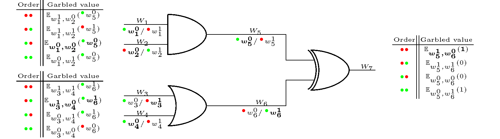

# Yao Garbled Circuit

Si supponga che Alice e Bob siano disposti a calcolare in modo sicuro una funzione $f(x, y)$ mantenendo segreti i rispettivi input $x$ e $y$.

Per fare ciò, essi modellano prima la funzione $f$ come un circuito booleano, questo è possibile poiché esiste un circuito booleano $C$ che calcola l'uscita di $f$ per qualsiasi funzione $f$ con ingressi di dimensione fissa. Tuttavia, il modo in cui tale modellazione viene eseguita può dipendere dalla funzione e non sarà ulteriormente discusso qui. Successivamente Alice confonderà il circuito booleano e: 

1. Per ogni filo $w_i$ del circuito $C$, sceglie casualmente due valori segreti $w^{0}_{i}$, $w^{1}_{i}$, dove $w^{j}_{i}$ è il valore confuso del valore $j \in \{0,1\}$ del filo $w_i$. Si noti che $w^{j}_{i}$ non può rivelare $j$ di per sé, quindi Alice deve tenere traccia di $i$ e $j$. Questo deve essere fatto per ogni singolo filo di ingresso e di uscita di ogni porta logica del circuito, tranne che per le porte di uscita del circuito che possono essere lasciate in chiaro.
2. Alice dovrà costruire una tabella di verità confusa (GTT) $T_i$ per ciascuna delle porte logiche $G_i$ in $C$.

\newpage

Queste tabelle devono essere tali che dati valori confusi lungo il suo insieme di fili d'ingresso, $T_i$ permetterà di recuperare l'uscita confusa di questo $G_i$ e nessun'altra informazione. Questo si ottiene attraverso la crittografia dei valori di uscita. Di seguito dettaglierò ulteriormente il garbling delle porte.

```{r chunk-label, echo = FALSE, fig.cap = 'AND gate con etichette e tabella di verità.', fig.pos = "!H"}
knitr::include_graphics("./media/01.png")
```

In seguito, Alice può tradurre ogni bit del suo input nei suoi corrispondenti valori confusi sui fili di ingresso del circuito. Successivamente può inviare il circuito, ora confuso, dove ogni porta è sostituita dal suo GTT a Bob con il suo input criptato.

Dopo che Bob ha ricevuto il circuito confuso, poiché tutti i fili d'ingresso sono criptati e solo Alice conosce la mappatura dei valori criptati e i bit reali, Bob ha bisogno di eseguire un Oblivious transfer con Alice per ciascuno dei suoi bit d'ingresso, in modo che Alice possa informarlo di quali valori criptati corrispondono ai suoi bit d'ingresso e sapere quali sono i suoi bit d'ingresso reali.

> **Oblivius transfer**: tipo di protocollo in cui il mittente trasmette un pezzo di informazione a un ricevitore, tra tante potenziali, ma rimane ignaro al mittente quale pezzo di informazione sia stato trasmesso.

Quindi significa che per ogni filo di ingresso, Bob sceglierà una tra le due stringhe casuali $w^{0}_{i}$, $w^{1}_{i}$ che corrispondono rispettivamente a $0$ e $1$, ma senza conoscere il contenuto della stringa che non sceglie. E grazie alle proprietà del Oblivious transfer Alice non può conoscere l'input di Bob.

Allora Bob ha tutti i valori necessari per calcolare l'uscita del circuito, come discuterò in seguito. Una volta fatto ciò, può comunicare i valori di uscita ad Alice. Così Bob è stato in grado di ottenere l'uscita di $f$ senza rivelare il suo input, né conoscere l'input di Alice, questo significa che Alice e Bob hanno simulato con successo una terza parte fidata e hanno eseguito un SMPC sicuro.

\newpage

## Garbling Logical Gates

La nozione di garbling delle porte logiche e della loro tabella di verità è cruciale in questa dinamica. Senza perdita di generalità, considererò solo le porte logiche con due fili di ingresso e un filo di uscita. Come spiegato precedentemente, per una data porta $G \in C$ e i suoi fili d'ingresso $W_0, W_1$ e il suo filo di uscita $W$, Alice doveva scegliere sei diverse stringhe casuali, $w^{0}_{0}, w^{1}_{0}, w^{0}_{1}, w^{1}_{1}, w^0, w^1$ che ha assegnato a ciascun valore dei fili in una mappatura uno a uno, dove $w^{j}_{i}$ rappresenta la stringa casuale assegnata al valore $j$ del filo $W_i$.

Quindi, per confondere la tabella di verità di $G$ in modo da non rivelare alcuna informazione dati due valori di ingresso $w_0$, $w_1$ eccetto il suo valore di uscita $w$ e  nemmeno il tipo di porta logica, Alice può criptare i valori di uscita $w_0$, $w_1$ usando i valori di ingresso confusi come chiavi, adottando un dato schema di crittografia simmetrica $\mathbb{E}$. Uso la notazione $\mathbb{E}_{k_0,k_2}(x) = \mathbb{E}_{k_0}(\mathbb{E}_{k_1}(x))$ per indicare la cifratura doppia con due chiavi date $k_0, k_1$. Come esempio, criptiamo la tabella di verità della porta AND della figura:

$$\begin{array}{c|c|c||c}
W_0 & W_1 & W & \text{Garbled value} \\ \hline
        w_0^0 & w_1^0 & w^0 & \mathbb{E}_{w_0^0,w_1^0}(w^0) \\
        w_0^0 & w_1^1 & w^0 & \mathbb{E}_{w_0^0,w_1^1}(w^0) \\
        w_0^1 & w_1^0 & w^0 & \mathbb{E}_{w_0^1,w_1^0}(w^0)\\
        w_0^1 & w_1^1 & w^1 & \mathbb{E}_{w_0^1,w_1^1}(w^1)	\\
\end{array}$$

La GTT $T$ del gate $G$ è semplicemente l'insieme $\left\lbrace\mathbb{E}_{w_0^j,w_1^k}(w^{G(j,k)}) \mid j,k \in  \left\lbrace0,1\right\rbrace \right\rbrace$ dei valori confusi, dove $G(j,k)$ corrisponde all'uscita della porta $G$ sotto ingressi $(j,k)$.

\newpage

## Valutazione del Garbled Circuit

Una volta che Bob ha ricevuto il circuito confuso $C$ da Alice e ha ottenuto i valori confusi del suo input attraverso diversi Oblivious transfer, può valutare il circuito.

È importante capire che un circuito confuso differisce da un normale circuito booleano. In un circuito booleano infatti, semantica e sintassi sono fondamentalmente le stesse: vengono assegnati ad ogni filo due possibili valori semantici, cioè Vero o Falso, che sintatticamente si denotano come un segnale con valori 1 o 0 rispettivamente.

In questi segnali erano pubblici, gli stessi segnali sono associati ad ogni filo e chiunque può dedurre dal segnale quale sia il suo valore semantico. Questa condizione cambia però in un circuito confuso poiché i valori semantici di ogni segnale, eccetto quelli di uscita del circuito, sono ora segreti e i segnali variano da un filo all'altro.

Così, per valutare il circuito, per ogni porta $G_i$ del circuito, Bob può provare a decifrare i valori nella tabella di verità associata $T_i$ usando i valori di ingresso della porta come chiavi. Una delle voci in $T_i$ sarà poi decifrata nell'uscita del gate. Quindi sembra necessario avere un oracolo che confermi il successo della decrittazione delle voci di $T_i$, tuttavia un trucco che descriverò in dettaglio ora, chiamato permute-and-point usato per la prima volta in [@fval] e poi spiegato chiaramente nella tesi di Phillip Rogoway [@prog], permette di decidere quale voce della GTT deve essere decrittata dati gli input confusi, permettendo calcoli più veloci e impedendo comunque al valutatore di dedurre qualcosa dall'ordine delle voci della tabella di verità.

## Permute-and-point

Il meccanismo di Permute-and-point funziona nel seguente modo: per ogni filo di ingresso e uscita $w_i$, Alice concatena un bit casuale $a \in \{0,1\}$ alla fine del suo valore confuso $w^{0}_i$ e concatena il suo valore inverso $b = \overline{a} = 1 - a$ alla fine di $w^{1}_{i}$. Permette dunque di associare ciascuna delle 4 permutazioni di 2 bit a una delle entrate della GTT, senza avere alcuna correlazione tra i bit e i valori della tabella della verità non confusa. In questo modo Alice può semplicemente ordinare la GTT secondo l'ordinamento naturale e darla a Bob che sarà quindi in grado di dedurre quale voce deve decifrare su un dato input. Per ottenere una rappresentazione chiara di questo trucco, quei bit possono essere visti come una coppia di colori, come rappresentato nella figura 2.2, in cui si notano le modalità con cui la tabella di verità viene modificata in modo da tenere conto di questo metodo.

\newpage


Queste modifiche permettono a Bob di decifrare semplicemente la voce il cui indice corrisponde ai colori associati ai suoi fili di ingresso e quindi di ottenere il valore del filo di uscita e il suo colore, permettendogli di valutare ulteriormente il circuito.

## Esempio di Valutazione



Vediamo ora come si potrebbe valutare il circuito confuso rappresentato nella Figura 2.3 usando il metodo permute-and-point che abbiamo discusso sopra. Assumiamo che i valori semantici di ingresso di $(W_1,W_2,W_3,W_4)$ siano $(0,0,1,0)$, il che significa che l'input confuso effettivo è $({\color{green}\bullet}{}w_1^0,{\color{red}\bullet}{}w_2^0,{\color{red}\bullet}{}w_3^1,{\color{green}\bullet}{}w_4^0)$ dove gli $w^i_j$ sono i valori casuali che Alice ha scelto quando ha confuso il circuito, come visto sopra. Assumiamo anche che Alice abbia già fornito il suo input confuso, diciamo $(W_1,W_3)$, e che Bob abbia già ottenuto il suo input confuso $(W_2,W_4)$ da Alice attraverso due applicazioni di Oblivious transfer come descritto nel paragrafo riguardante.

Bob comincerà quindi a valutare prima la porta AND utilizzando l'ingresso $({\color{green}\bullet}{}w_1^0,{\color{red}\bullet}{}w_2^0)$, dato che ha i colori $\color{green}\bullet\color{red}\bullet$ cercherà di decifrare la terza voce della GGT della porta AND, che funziona e quindi gli fornirà il valore confuso ${\color{green}\bullet}{}w_5^0$.

Potrà poi continuare la sua valutazione con la seconda porta, che è la porta OR. Guardando il suo ingresso $({\color{red}\bullet}{}w_3^1,{\color{green}\bullet}{}w_4^0)$ e proverà a decifrare la voce corrispondente a $\color{red}\bullet\color{green}\bullet$ con le chiavi $(w_3^1,w_4^0)$, essa si decifra nel valore confuso ${\color{green}\bullet}{}w_6^1$.

Potrà ora decifrare la porta XOR finale usando l'ingresso calcolato $({\color{green}\bullet}{}w_5^0,{\color{green}\bullet}{}w_6^1)$, decifrando così la voce $\color{green}\bullet\color{green}\bullet$ che gli fornisce il risultato finale: $1$.

Bob non sa quale sia stato l'input di Alice, ne conosce solo l'output finale "1" e le stringhe generate casualmente $w_1^0,w_2^0,w_3^1,w_4^0,w_5^0,w_6^1$. Egli può ancora, per esempio, dedurre dal circuito che i valori semantici di $w_5^0$ e $w_6^1$ sono opposti, tuttavia questo sistema non gli permette di invertire il circuito confuso fino ai valori di ingresso di Alice. 

Ci sono circuiti in cui non è assicurata la privacy, come per esempio un circuito che calcola la somma degli ingressi. Tuttavia, in questo caso di esempio Bob, conoscendo i suoi valori semantici di ingresso, può semplicemente limitare gli ingressi di Alice a un sottoinsieme dei possibili ingressi, ma non può determinare in modo univoco i reali valori di ingresso di Alice.