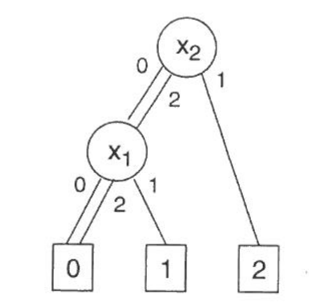

# Analisi

Il protocollo di Yao prevede, durante i suoi scambi, che le due parti coinvolte concordino anche sulla trasmissione di un circuito a cui entrambi gli attori debbano inserire dei valori di input. Uno degli scopi della nostra tesi consiste nel testare l’efficacia dell’utilizzo di un multi valore rispetto all’utilizzo “classico” di un circuito booleano, concentrandoci specificatamente sull'importante valore costituito dal fattore di costo computazionale delle operazioni che vengono svolte.

Per avviare la nostra analisi siamo partiti quindi selezionando un set di circuiti binari con caratteristiche diverse, tra cui differente numero di ingressi, uscite e livelli. Partendo da questa base ci siamo successivamente concentrati sulla ricerca di una metodologia di conversione dei circuiti atta a traslarli da un ‘classico’ dominio booleano ad uno multi valore, dove quindi i valori non sono più rappresentati da 0 e 1 ma da  un set più ampio di valori. Tutto ciò sempre  mantenendo le funzionalità del circuito. Una volta ottenuta una controparte per ogni circuito si è proceduto con un confronto dei circuiti al fine di riuscire ad individuare quali di questi set fossero più efficaci.

\newpage

## La logica multi-valore

La logica multi-valore è una generalizzazione della classica logica booleana. Una delle ragioni per la quale è stata presa in considerazione è che essa può portare ad una comprensione più profonda di problemi specifici. La logica multi valore può avere numerosi vantaggi teorici rispetto a quelle booleana:

- Memory design: Memorizzare informazioni a blocchi di 2bit invece che uno raddoppia la densità delle informazioni che si possono racchiudere nello stesso spazio.
- Utilizzo per rappresentazione di funzioni booleane con più output;
- Design di PLA con input decoder;
- Ottimizzazione di macchine a stato finite;
- Testing e verifica.

Le potenzialità pratiche di questi vantaggi dipendono pesantemente dalla disponibilità della realizzazione di questi circuiti che devono comunque rimanere compatibili con gli standard tecnologici odierni. [@gao2002optimization]

\newpage

### Le funzioni multi-valore

Una funzione multi-valore è una funzione discreta che ha, sia come input che come output, delle variabili che assumono più di 2 valori. Solitamente le funzioni multi-valore sono definite come: $f: P_1 \times P_2 \times ... P_n \rightarrow Q$ dove le variabili $x_i$ della funzione prendono valore dal gruppo $P_i = \{ 0,1,2,...,p_i-1 \}, p_i > 1 
, i \in \{ 1,2,...,n\}$ e la funzione prende valori dal set $Q = \{0,1,2,...,q\}, q>1$

### Rappresentazione di funzioni multi-valore

Il modo più semplice per rappresentare un funzione con $m$ valori e $n$ variabili consiste nel creare una tabella di verità con $m^n$ righe, ognuna delle quali specifica il valore della funzione corrispondente alla combinazione delle variabili in ingresso. Una tabella di verità può essere ridisegnata come un rettangolo n-dimensionale con m-valore in una mappa di Karneaugh. Il problema di queste due rappresentazioni consiste nella difficoltà di raffigurazione in caso di tabelle complesse. Nei prossimi capitoli mostrerò metodi di rappresentazione più efficaci per la logica multi valore.

#### Positional cube notation

Utilizzata nella logica booleana, questa tecnica di visualizzazione può essere applicata anche per funzioni con input multi valore e output booleano. A differenza di un letterale binario, $x$ o $x'$, viene rappresentato da un campo a 2 bit, una funzione letterale multi valore $m$ viene rappresenta con un campo a $m$ bit. Il valore $i \in M$ corrisponde al bit $i$ dell campo. Un letterale $x^S$ presenta il valore 1 in tutte le posizioni $i \in S$. Per esempio:

$$\begin{tabular}{ c|c c c} 
 \hline
 x1/x2 & 0 & 1 & 2 \\ 
 0 & 1 & 0 & 0 \\ 
 1 & 1 & 1 & 1 \\
 2 & 0 & 1 & 1 \\
 \hline
\end{tabular}$$

\newpage

Applicando la Positional Cube Notation esso diventa:

$$\begin{array}{ccc}
110 & - & 100 \\
101 & - & 010 \\
011 & - & 001 
\end{array}$$

Per quanto riguarda il caso booleano la condizione don't care di un valore in una riga corrisponde al fatto che quell'elemento può assumere valori 0 o 1. Per una funzione multi valore, invece, una condizione don't care può essere rappresentata nel seguente modo:

- Si spezza la funzione $f: M^n \rightarrow M$, rispettandone tutti i valori $i \in M$, generando $m$ funzioni multi valore, input e output multi valore utilizzando la seguente logica $f^i: M^n \rightarrow \{0,1\}$
- Infine si rappresenta ognuna delle funzioni spezzate nella notazione. [@Dubrova2002]

#### Multiple Valued Network

Una Multiple Valued network è un grafo multi-livello simile a quello booleano con la differenza che ogni nodo rappresenta una funzione multi valore. Per sistemi con alto livello di astrazione l'utilizzo di questi grafi può rendere il design della progettazione più intuitivo. Prendiamo, per esempio, il controller di un semaforo, esso può prendere valore _rosso_, _giallo_ o _verde_ piuttosto che considerare l'encoding in modo binario. Questo tipo di progettazione è possibile solamente semplificando il sistema fino al punto in cui non è possibile renderlo ancora più ottimale nella manipolazione del dominio dei valori. Il lato negativo di questa tecnica è che la rappresentazione di un sistema non si presenta in forma canonica, poichè una funzione può assumere più rappresentazioni. Questo lato negativo rende il testing più difficoltoso.

\newpage

#### MDDS

I Multiple Valued Decision Diagrams sono una generalizzazione degli alberi binari di decisione (BDDs). Le funzioni sono rappresentate creando un diagramma aciclico con nodi non terminali $v$ etichettati da una variabile di indice $index(i), i \in \{1,2,...,n\}$. Ogni vertice $v$ ha $m$ uscite dirette verso i nodi figli, chiamati $child_j(v), j \in M$. Ogni vertice terminale $v$ ha come attributo un valore $value(v)$ in $M$.

{width=70%}

\newpage

## Studio del circuito binario

Analizzando i vari circuiti per testare la tesi  è stato necessario, ai fini dell’analisi, sviluppare una tecnica di conversione dei circuiti binari di partenza. La caratteristica di una naturale rappresentazione di un circuito consiste nella sua divisione in nodi, ognuno dei quali viene rappresentato da una tabella di verità i cui input e output vanno a correlarsi tra loro tramite dei collegamenti. Soffermandosi più attentamente sulle tabelle di verità è stato possibile notare come, andando ad applicare un raggruppamento di $n$ bit per ogni riga della tabella, sarebbe possibile riuscire a rappresentare un valore di dominio più grande di quello binario del circuito in analisi. Di conseguenza, così facendo, è possibile attuare una riduzione del numero di input richiesti dal gate.

$$\begin{matrix}
    \underbrace{10} & \underbrace{11} & \underbrace{00} \\
    \downarrow & \downarrow & \downarrow  &mod_3 \\
    2 & 3 & 0
\end{matrix}$$

Con questo approccio è possibile non snaturare quella che è la logica della tabella originale poiché, sapendo qual è il nuovo dominio applicato,  vi è la possibilità di invertire il processo di conversione, ritornando quindi al circuito originale.

È necessario però considerare i vincoli presentati da questo approccio di conversione dei circuiti booleani. Queste limitazioni risiedono nel fatto che, al momento, la conversione può essere attuata solo e soltanto con un numero pari di input e che il numero di output sia un divisore del numero di bit utilizzati per il raggruppamento.

\newpage

Una volta definito il metodo di conversione e preso atto dei vincoli di questo tipo di approccio, abbiamo proseguito con la scelta del nuovo dominio da applicare ai circuiti, questo con l’obiettivo di trovare il giusto compromesso per ottenere i seguenti  risultati:

- Una riduzione degli input che facesse diminuire il costo del circuito di ingresso rispetto al circuito di partenza.
- Trovare un dominio multi valore che risulti efficace nella riduzione dei costi. avere un dominio superiore a quello booleano ma troppo elevato significherebbe che, per ogni input, ogni parte dovrebbe inserire tanti valori di input quanti quelli del dominio richiesto e, se si sceglie un dominio troppo grande, nonostante la riduzione degli input ci si troverebbe comunque con un costo totale del circuito elevato. Si è deciso quindi di sperimentare 2 approcci alla scelta di questo valore, uno statico e uno dinamico.

    - **Statico**: per ognuno dei circuiti andremo ad applicare lo stesso valore di dominio, il valore scelto è 3,  in seguito procederemo quindi a raggruppare ogni 2 valori per riga della tabella di verità;
    - **Dinamico**:ogni circuito  verrà analizzato andando a trovare il numero di input e output, successivamente procedendo con il calcolo del valore di M.C.D. e:
        - Se il valore trovato consente alla tabella di verità convertita di avere almeno 2 valori di input, in quel caso si utilizza quel valore per raggruppare i bit delle righe, altrimenti il valore viene dimezzato.
        - Se il valore risultante è un numero che creerebbe un dominio troppo grande, in quel caso viene utilizzato il dominio 3, come nel caso statico.

Una volta definite tutte le logiche di conversione è stato necessario affrontare una seconda problematica: identificare un formato di file che rispettasse determinati requisiti, tra questi citiamo:

- un formato in grado di rappresentare i circuiti
- un formato che rispetti le esigenze per poter applicare tutte le elaborazioni sopra descritte
- un formato che possa essere scelto come standard di rappresentazione in modo tale che i risultati ottenuti possano essere utilizzati dai software di sintesi che andremo ad utilizzare successivamente durante l’elaborazione della sperimentazione.

\newpage

Si è presentata dunque la necessità di una rappresentazione che avesse la possibilità di rappresentare i circuiti con output multipli sulla stessa linea all’interno della tabella di verità.

Tra i vari formati a disposizione, dopo averne analizzate le caratteristiche, la scelta è ricaduta sul formato `PLA`, già ampiamente utilizzato per la rappresentazione di circuiti.
Per comprendere meglio questa scelta è necessario però andare a sviscerare le caratteristiche e la struttura del formato selezionato.

### Analisi della struttura PLA

La struttura di un file PLA può essere così descritta:

```pla
.i 4
.o 2
.ilb x1 x2 y1 y2
.ob f1 f2
0--0 00    
0001 01
0-11 --
1-11 01
0101 10
10-- 01
11-- 00
.end
```

Questo `PLA` preso come esempio rappresenta un circuito composto da una sola tabella di verità, la sintassi va a descrivere gli elementi nel seguente modo:

- `.i`: numero di valori di input;
- `.o`: numero di valori di output;
- `.ilb`: nomi e ordine delle variabili di input;
- `.ob`: nomi e ordine delle variabili di output.

\newpage

Il resto del file riportato rappresenta la tabella di verità con i possibili valori che si ottengono combinando i valori di input_file per ottenere gli output. Il circuito sopra descritto presenta 4 variabili di input e 2 valori di output. Come possiamo osservare all’interno della tabella di verità non tutti i valori sono booleani, è infatti presente anche il valore “-”, esso prende il nome di don’t care e, all’interno del file, può assumere due significati diversi:

- Quando - è presente negli output di una riga significa che l’output per quella determinata riga non genera un valore interessante ai fini dell’analisi;
- Quando - è presente negli input significa che, in quella posizione, la variabile a cui fa riferimento può assumere un qualsiasi valore non andando ad influire sul valore di output che si andrà ad ottenere.

La presenza di questo nuovo valore, non presente nel caso dei circuiti booleani classici, ci presenta la necessità di analizzare  e capire il metodo con cui andare a gestire questi don’t care all’interno del circuito.

### La gestione dei don't care durante la conversione

I dont’t care sono una caratteristica dei file PLA che deve essere gestita in modo funzionale ai cambi di dominio che andremo ad eseguire  all’interno delle tabelle di verità dei nostri circuiti. Questa gestione è di primaria importanza in quanto, se affrontata nel modo sbagliato, modificherebbe la logica dell’intero circuito,  rendendo di conseguenza la conversione errata. Per fare più chiarezza riguardo il trattamento che va applicato a questa caratteristica dei PLA, è presentato l’esempio di un circuito semplice che ha come valore di dominio di conversione il valore 3. Il circuito avrà la seguente struttura:

```
.i 4
.o 2
.ilb x1 x2 y1 y2
.ob f1 f2
0--0 00    
0001 01
0-11 --
1-11 01
0101 10
10-- 01
11-- 00
.end
```

\newpage

Una volta stabilito il nostro nuovo dominio di conversione sappiamo quanti bit dobbiamo raggruppare per rappresentare il nostro nuovo dominio. Nel nostro caso, essendo il domino 3, il numero di bit per rappresentare il valore più grande di questo dominio, abbiamo bisogno di un raggruppamento a 2 bit. Procediamo quindi a scandire riga per riga il circuito, raggruppando i bit a blocchi di due sia per tutti i valori di input che per quelli di output.

```
0- -0 00    
00 01 01
0- 11 --
1- 11 01
01 01 10
10 -- 01
11 -- 00
```

Una volta creati questi cluster di bit ci rendiamo conto di come i dont’t care, in alcuni casi, ci rendano impossibile la conversione al nuovo dominio. Per fare in modo che questo problema venga risolto, sarà necessario andare a sviluppare questi valori di don’t care in ‘normali’ valori booleani.

\newpage

Non è però sempre necessario andare a sviluppare i don’t care, per questo motivo si differenziano due possibili casistiche di intervento applicabili a questi casi:
- Quando il numero di ‘-’ è uguale al numero di bit del raggruppamento multi valore. Quando si presenta questa situazione non c’è la necessità di sviluppare i valori, sarà  infatti sufficiente inserire al posto della coppia di bit un nuovo - rappresentante il don’t care.
    $$ \begin{array}{ccc}
        10 & -- & 01 \\ & \downarrow & \\ 2 & - & 1 
    \end{array}$$
- Quando nel gruppo di bit raggruppati il numero di - è minore del numero di bit richiesti. Quando si presenta questa circostanza è necessario procedere con l’espansione del dont’t care a valori di verità, questo in modo tale da poter affrontare correttamente la conversione nel nuovo dominio.
        $$ \begin{array}{cccc}
            1- & 11 & 01\\
            & \downarrow &\\
            10 & 11 & 01\\
            11 & 11 & 01\\
            & \downarrow &\\
            2 & 3 & 1\\
            3 & 3 & 1
        \end{array}$$

\newpage

Analizzando e applicando queste due differenti casistiche ci è dunque possibile sviluppare tutto il circuito binario e ottenere una conversione esatta. Il circuito convertito sarà quindi.

```
00 0
02 0
10 0
12 0
01 1
03 -
13 -
23 1
11 2
2- 1
3- 0
```

Con questa nuova struttura è in fine possibile procedere all’analisi dei circuiti, proseguendo in seguito con l’attività di sintesi logica.

## Implementazione della conversione

La conversione dei circuiti in analisi viene implementata utilizzando il linguaggio di programmazione Python nella versione 3.8. Questo implemento avviene senza l’ausilio di nessun package esterno, vengono infatti utilizzate solamente librerie che sono già comprese nel linguaggio in questione.

Questa dinamica fa si che il sistema, una volta installato il linguaggio di programmazione, se non già presente all’interno del SO, risulti essere “ready to use”.

\newpage

### Analisi del circuito

```python
def read_pla(path_file):
  inp = None
  out = None
  inp_array = []
  out_array = []
  truth_table = []
  with open(path_file, 'r') as input_file:
    for line in input_file.readlines():
      if '.i' in line and line[2] == ' ':
        inp = line.split(' ')[1]
      elif '.o' in line and line[2] == ' ':
        out = line.split(' ')[1]
      elif '.ilb' in line:
        inp_array = line.strip().split(' ')[1:]
      elif '.ob' in line:
        out_array = line.strip().split(' ')[1:]
      elif '.end' in line:
        continue
      else:
        line = {
          'inp':  line.strip().split(' ')[0],
          'out':  line.strip().split(' ')[1]
        }
        truth_table.append(line)
  return inp, out, inp_array, out_array, truth_table
```

All’interno del processo sopra rappresentato la funzione prende in input un circuito binario in formato PLA. Riga per riga,  procede ad un’analisi delle informazioni in base al prefisso all’interno di ogni riga del file. Questo prefisso va a differenziare le informazioni del circuito e scandendo il file recupera le seguenti informazioni:

- Tabella delle verità
- Numero di input
- Numero di output
- Array contenente il nome delle variabili di input;
- Array contenente il nome delle variabili di output;

Queste informazioni saranno necessarie successivamente per poter convertire il circuito e poterne calcolare costi effettivi.

\newpage

### Espansione dei don't care

Una volta ottenute tutte le informazioni disponibili dal circuito dato, succesivamente è necessario andare ad identificare all’interno delle tabelle di verità quali sono i don’t care a cui bisogna espandere i valori e quelli che si possono ignorare. Questo passaggio nello specifico è stato la parte più impegnativa riguardante le funzionalità del programma.

```python
n_dont_care = ''
  for i in range(dv):
    n_dont_care += '-'
```

Con questo ciclo vado a creare un array di `-` consecutivi che rispecchiano i cluster di don't care da ignorare nel durante l'analisi delle tabelle di verità. Avrò quindi un array di *n* `-` tanti quanti il numero di bit per rappresentare i numeri del nuovo dominio.

```python
len_truth_table = len(truth_table)
i = 0
while i < len_truth_table:
  if '-' in truth_table[i]['inp']:
    truth_table[i]['inp'] = ''.join(truth_table[i['inp'])
    truth_table[i]['inp'] = [truth_table[i]['inp'[a:a+dv]
                             for a in range(0, le(truth_table[i]['inp'], dv)]
    for a in range(len(truth_table[i]['inp'])):
        if truth_table[i]['inp'][a] == n_dont_care:
            truth_table[i]['inp'][a] = 'k'*le(n_dont_care)
    truth_table[i]['inp'] = ''.join(truth_table[i['inp'])
    new_lines = resolve_dont_care(truth_table[i],'inp')
    truth_table = truth_table[:i] + new_lines +truth_table[i+1:]
    len_truth_table = len(truth_table)
  i += 1
```

\newpage

Tramite questo ciclo *while* l'intero circuito viene scandito e: 

- I valori di input vengono divisi in cluster di *n* bit per rappresentare i nuovi valori del dominio;
 ```python
truth_table[i]['inp'] = [
    truth_table[i]['inp'[a:a+dv]
    for a in range(0, le(truth_table[i]['inp'], dv)]
  ]
```
- Se all'interno dei cluster sono presenti solamente don't care il valore `-` viene sostituito con il valore *k* per differenziarli dai valori dont't care che successivamente verranno espansi
```python
if truth_table[i]['inp'][a] == n_dont_care:
  truth_table[i]['inp'][a] = 'k'*le(n_dont_care)
```

Ora la tabelle è finalmente pronta per l'espansione dei don't care tramite l'appostia funzione sviluppata

Si è utilizzato un ciclo _while_ in questa funzione nonostante in Python sia meno efficiente a causa della natura della sua implementazione; questo perchè la lunghezza della tabella della verità aumenta dinamicamente con l'andare dell'espansione dei don't care individuati.

#### Resolve don't care

La funzione inizia andando ad individuare quanti don't care sono presenti nella linea

```python
def resolve_dont_care(line, in_out):
  n_dc = pow(2, line[in_out].count('-'))
```

\newpage

Successivamente viene iniziato un ciclo che scandisce ogni elemento della linea della tabella di verità, viene creato un array binario della di tante righe quante saranno dopo l'espansione dei don't care.

```python
for h in range(line[in_out].count('-')):
  val_array = create_0_1_array(n_dc, pow(2, h))
```

Successivamente vengono differenziate 2 casistiche:

- Prima iterazione

```python
if h == 0:
  for i in range(n_dc):
    it = 0
    new_line = []
    for j in range(len(input_entry)-1, -1, -1):
      if input_entry[j] == '-' and it == 0:
        new_line.append(val_array[(len(val_array)-1) - i])
        it += 1
      else:
        new_line.append(line[in_out][j])
    new_array.append(new_line[::-1])
```

- Tutte le successive

```python
else:
  it = 0
  for c, l in enumerate(new_array):
    for j in range(len(l)-1, -1, -1):
      if l[j] == '-' and it == 0:
        l[j] = val_array[(len(val_array)-1) - c]
        it += 1
    it = 0
```

Ogni riga viene scandita a partire dal fondo per iniziare a convertire i don't care corrispondenti ai valori meno significativi. Sfruttando l'array binario creato sopra andiamo a sostituire il simbolo '-' con con il valore booleano corrispondente e quindi a creare una nuova linea di un array che conterrà tutti i valori ottenuti dall'espansione.

\newpage

```python
if in_out == 'inp':
  return [{'inp':  l, 'out':  line['out']} for l in new_array]
else:
  return [{'inp':  line['inp'], 'out':  l} for l in new_array]
```

Come possiamo notare dal ```return``` della funzione, questa operazione di espansione è possibile sia sugli input che su gli output. Come detto nel capitolo precedente anche l'espansione dei valori di don't care degli output è importante per non perdere l'integrità del circuito.

L'oggetto restituito dalla funzione è un array contenente un vocabolario con la stessa struttura che è stata usata durante l'estrazione dei dati dal file `PLA`, questo array sostituirà la riga contenente i don't care espansi.

#### create_0_1_array

```python
def create_0_1_array(le, pad):
  count_1 = pad
  count_0 = pad
  return [str(1) if i % (count_1 + count_0) < count_1 
    else str(0) for i in range(le)]
```

Questa funzione restituisce una tabella di verità data una linea con all’interno un numero di don’t care che necessitano di espansione.

Questa tabella creata verrà inserita al posto della linea con i don’t care del circuito in modo tale  da avere la tabella corretta per la conversione.

Una volta terminato l'intero ciclo tutti i dont't care saranno risolti e la tabella sarà pronta per la conversione nel nuovo valore di dominio.

\newpage

## La conversione in multi valore

Le funzioni analizzate e osservate nelle sezioni precedenti restituiscono sempre come valore di output una matrice corrispondente alla tabella della verità sviluppata. Questa tabella verrà utilizzata dalla funzione di conversione seguendo lo schema spiegato all’inizio del capitolo.

```python
def create_mv_truth_table(truth_array, dv):
  conv_truth = []
  for line in truth_array:
    line['inp'] = ''.join(line['inp'])
    line['inp'] = [line['inp'][i * dv:(i + 1) * dv]
      for i in range((len(line['inp']) + dv - 1) // dv)]
    if '-' not in line['out']:
      line['out'] = ''.join(line['out'])
      line['out'] = [line['out'][i * dv:(i + 1) * dv]
        for i in range((len(line['out']) + dv - 1) // dv)]
      l_supp_inp = []
      l_supp_out = []
      for val in line['inp']:
        if '-' not in val:
          l_supp_inp.append(int(val, 2))
        else:
          l_supp_inp.append('-')
      for val in line['out']:
        l_supp_out.append(int(val, 2))
      conv_truth.append({
        'inp':  l_supp_inp,
        'out':  l_supp_out
      })
  return conv_truth
```

La funzione prende in ingresso la matrice espansa creata precedentemente e il numero di bit da utilizzare per rappresentare il massimo numero del nuovo dominio multi valore.

\newpage

Inizialmente la funzione 'spezza' la stringa dei valori di input in gruppi di tanti elementi quanti sono i bit per rappresentare il massimo numero, successivamente viene controllato se il gruppo è composto da:

- dont’t care:  in questo caso si procede sostituendoli con un singolo simbolo ‘-’
- numeri binari:  in quest’altro caso si procede con la conversione tramite il metodo int(), per applicare questa conversione sono però necessari due parametri differenti:
  - un numero o una stringa di numeri da convertire
  - la base a cui si vuole fare la conversione

Una volta scandita tutta la tabella di verità abbiamo finalmente ricavato un circuito convertito. L’utlimo processo da mettere in atto consiste nell’andare a creare un file compatibile per la sintesi dei circuiti.

## La creazione del file blfmv

Per i circuiti multi valore non viene adottato il formato PLA in quanto quest’ultimo viene utilizzato solamente per i circuiti binari. Per sopperire a questa limitazione data dal formato PLA si farà uso di un altro formato standard appositamente creato per la logica multi valore:  il formato blfmv.

Questo formato deriva dal formato blif, ampiamente utilizzato per la logica binaria.

```python
import string
mv_input = [i for i in list(string.ascii_lowercase)[
    :len(mv_table[0]['inp'])]
  ]
mv_output = ['o{}'.format(i) for i in range(len(mv_table[0]['out']))]
with open('{}/blfmv/{}.mv'.format(working_dir, nomefile), 'w') as blif:
  blif.write('.model {}\n'.format(working_dir, nomefile))
  blif.write('.inputs {}\n'.format(
      ' '.join(map(str, mv_input))))
  blif.write('.outputs {}\n'.format(
      ' '.join(map(str, mv_output))))
  blif.write('.mv {} {}\n'.format(
      ', '.join(map(str, mv_input)), mv))
  blif.write('.mv {} {}\n'.format(
      ', '.join(map(str, mv_output)), mv))
  for count, out in enumerate(mv_output):
      blif.write('.table {} {}\n'.format(' '.join(map(str,mv_input)), out))
    for line in mv_table:
      blif.write('{} {}\n'.format(
        ' '.join(map(str, line['inp'])), line['out'][count]))
  blif.write('.end\n')
```

Questa funzione crea un file .mv relativo al circuito creato. Scegliamo questa tipo di file e sintassi poiché nelle fasi successive andremo ad utilizzare dei software che accettano questa sintassi per valutare e sintetizzare i circuiti.

\newpage

## La sintesi

Una volta ottenuti sia il circuito booleano che quello multi valore procederemo con la sintesi dei circuiti. Quest’ultima si pone come obiettivo la riduzione e l’ottimizzazione della struttura dei circuiti stessi, andando a diminuire il numero di ingressi e di tabelle della verità in modo tale da avere dei costi totali minori.

I programmi utilizzati per la sintesi logica sono stati entrambi sviluppati dall'università di Berkley e attualmente sono disponibili con licenza open source.

Per la sintesi durante l’analisi sperimentale sono state utilizzate due alternative:

- MVSIS
- ABC

### MVSIS

E’ il primo programma utilizzato, al suo interno troviamo diversi metodi di sintesi da poter applicare, i quali sfruttano tecniche differenti. La particolarità di questo tool consiste nel fatto che il programma è in grado di accettare come input sia circuiti binari che multi valore. Il lato negativo dell’utilizzo di questo programma, d’altra parte, è che l’ultima versione di questo software risale al 2005 e quindi non è più mantenuto.

### ABC

ABC, come la sua alternativa descritta sopra, mette a disposizione delle tecniche di sintesi  che presentano il vantaggio di avere degli script pronti che uniscono più metodi, in questo modo è possibile avere la certezza di non commettere errori o di utilizzare una concatenazione di metodi inefficace.

ABC è un’evoluzione di MVSIS e del più vecchio SIS. Esso viene tuttora mantenuto ma, a differenza di MVSIS, se gli viene dato in ingresso un valore di input, esso viene successivamente convertito in binario e solo in seguito è possibile utilizzare i metodi di sintesi.

Una caratteristica molto utile di questi programmi sta nel fatto che essi accettano come parametri di ingresso degli script contenenti tutte le istruzioni da eseguire. Proseguendo con lo sviluppo della tesi sarà possibile dimostrare come tutto il processo di analisi viene automatizzato sfruttando questa caratteristica.

\newpage

### La sintesi tramite i software

La letteratura mette già a disposizione delle sequenze di metodi di sintesi e pulizia dei circuiti efficace ed efficiente, questi comandi si possono chiamare semplicemente dando in input ai due programmi un file contenente un alias per questa sequenza di istruzioni.

```
source abc_alias.abc
read_blif_mv ./prova/blfmv/amd.mv
strash
compress2
cl
resyn2
cl
write_blif_mv ./prova/blfmv/synth/amd.mv
```

Il programma, in questo caso ABC, non fa altro che prendere come input uno dei circuiti creati precedentemente e, applicando i metodi di sintesi, crea un ulteriore file contenente il circuito sintetizzato. In questo modo è successivamente possibile fare degli ulteriori confronti, una volta sintetizzati tutti i circuiti.

## Il calcolo dei costi del circuito

Il costo del circuito viene calcolato sulla base di due fattori fondamentali:
- Quanti input devono inviare entrambe le parti
- Quanti valori devono inviare per ciascun valore di input in base al dominio

Per calcolare questo tipo di informazioni si devono effettuare delle ulteriori operazioni di lettura sui file precedentemente creati, il tutto analizzando due differenti caratteristiche:

- Gli ingressi di ogni tabella di verità del circuito (andando a controllare quali dei valori di input devono essere inseriti da una delle parti e quali sono ingressi di valori di output delle altre tabelle.)
- Il dominio dei valori di input che devono inserire le parti.

\newpage

### blfmv vs pla

Per poter eseguire il confronto sopra citato si è preferito utilizzare file che avessero la stessa sintassi di rappresentazione del circuito, sia nel caso multi valore che in quello booleano.

Il formato *pla* attualmente non dispone di un’alternativa per i file multi valore, ma non è ancora supportata dai tool che abbiamo in utilizzo. Per questo motivo si è deciso di utilizzare il formato *blif* per rappresentare i circuiti binari. *Blif* è l’alternativa binaria a *blfmv*, la sintassi è la stessa con la differenza che non viene specificato il dominio dei valori di input in quanto sempre booleano.

La differenza con *pla*, invece, sta nel fatto che gli output non possono essere in numero maggiore di 1 per tabella: nella rappresentazione avrò quindi, per ogni nodo del circuito, tante tabelle quanti sono gli output di quel nodo. Questa tipologia di rappresentazione è utilizzata anche nei file *blfmv*, quindi sarà possibile una comparazione 1:1 tra il circuito binario e quello multi valore.

Per effettuare questa conversione vengono in aiuto i tool ABC e MVSIS, poiché entrambi contengono metodi di conversione automatica da *pla* a *blif*. Questa operazione viene effettuata tramite uno script contenente le istruzioni da eseguire e dato come parametro di ingresso al programma. [@kukimoto1996blif]

```
read_pla ./prova/pla/alu2.pla
write_blif ./prova/blif/alu2.blif
```

A questo punto dell’analisi abbiamo a disposizione tutti i file per poter fare effettuare il confronto dei costi.

\newpage

### Implementazione

```python
with open('{}/{}'.format(working_dir, circuito)) as circ:
  input = None
  output = None
  mv = int(0)
  table_array = []
  for line in circ.readlines():
    if '.inputs' in line.strip():
      input = line.strip().split(' ')[1:]
    if '.outputs' in line.strip():
      output = line.strip().split(' ')[1:]
    if '.mv' in line.strip():
      if mv < int(line.strip().split(' ')[-1]):
        mv = int(line.strip().split(' ')[-1])
    if '.table' in line.strip():
      l = line.strip().split(' ')
      table_array.append(
        {
          'input':    l[1:len(l)-1],
          'output':   l[-1]
        }
      )
    if '.names' in line.strip():
      l = line.strip().split(' ')
      table_array.append(
        {
          'input':    l[1:len(l)-1],
          'output':   l[-1]
        }
      )
  # i blif non hanno .mv, quindi gli do il valore di dominio
  if mv == 0:
    mv = 2
  return {
    'dominio':   mv,
    'input':    input,
    'output':   output,
    'tabelle':  table_array
  }
```

\newpage

Questa funzione, dato un circuito sia binario che mutli-valore, prende tutte le informazioni ad essa necessarie per poter effettuare il calcolo.

```python
costo = 0
for t in circuito['tabelle']:
  intersection = len(set(circuito['input']).intersection(t['input']))
  costo = costo + pow(circuito['dominio'], intersection)
return costo
```

Una volta eseguita questa conversione è stato possibile ottenere tutti i valori di costo sia dei circuiti booleani che di quelli binari.

```python
with open('calcolo_costi.csv', 'a') as file:
  file.write(
    'NOME CIRC;COSTO BOOLEANO;INPUT ALICE;INPUT BOB;
    DOMINIO MULTIVALORE;COSTO MULTIVALORE;INPUT ALICEINPUT BOB\n')
  for blfmv in listdir('{}/blfmv'.format(working_dir)):
    if blfmv.endswith('.mv'):
      circ_mv = info_circuito(
          '{}/blfmv/synth'.format(working_dir),blfmv)
      costo_mv = calcolo_costo_circuito(circ_mv)
      if len(circ_mv['input']) % 2 != 0:
          alice_var_mv = int(len(circ_mv['input'])/ 2)
          bob_var_mv = int(len(circ_mv['input']) /2) + 1
      else:
          alice_var_mv = int(len(circ_mv['input'])/ 2)
          bob_var_mv = int(len(circ_mv['input']) /2)
      circ_bool = info_circuito(
          '{}/blif/synth'.format(working_dir), '{}blif'.format(blfmv.split('.')[0]))
      costo_bool = calcolo_costo_circuito(circ_bool)
      if len(circ_bool['input']) % 2 != 0:
          alice_var_bool = int(len(circ_boo['input']) / 2)
          bob_var_bool = int(len(circ_bool['input') / 2) + 1
      else:
          alice_var_bool = int(len(circ_boo['input']) / 2)
          bob_var_bool = int(len(circ_bool['input') / 2)
      file.write('{};{};{};{};{};{};{};{}\n'.forma(blfmv.split('.')[
          0], costo_bool, alice_var_bool,bob_var_bool, circ_mv['dominio'],costo_mv, alice_var_mv, bob_var_mv))
```

Ottenute tutte le informazioni, per avere una migliore visione per l’analisi, esse vengono salvate all'interno di una file _CVS_ con la funzione sopra mostrata.

\newpage

## Automatizzazione dei processi

Tutte le fasi mostrate sopra, più altre secondarie, sono state automatizzate in modo tale che:

- non si debbano effettuare operazioni ridondati per ogni circuito
- non si generino perdite di dati causate da errori umani.

### Struttura

```
.
├── abc_alias.abc           #alias con metodi sintesi ABC
├── automate.py             #automatizzatore dei processi
├── calcolo_costi.csv
├── calcolo_costi_no_synth.csv
├── facili  #directory contenente i file d'analisi
│   ├── blfmv
│   │   └── synth # circuiti sintetizzati
│   ├── blif
│   │   └── synth
│   └── pla_extended #pla espansi per debugging
├── lib_mv  # libreria con tutti le funzioni create
│   ├── automate_mvsis.py
│   ├── bin_to_mv.py
│   └── caloclo_costo.py
├── pla_to_blif.mvsis   #file con sintesi per MVSIS
├── synth_bool.abc      #file di sintesi  binaria per ABC
└── synth_mv.abc        #file di sintesi multi valore per ABC
```

\newpage

```python
working_dir = './prova'
 if path.exists('{}/blif'.format(working_dir)) 
    and path.exists('{}/blfmv'.format(working_dir)):
        rmtree('{}/blif'.format(working_dir))
        rmtree('{}/blfmv'.format(working_dir))
      
makedirs('{}/blif/synth'.format(working_dir))
makedirs('{}/blfmv/synth'.format(working_dir))
makedirs('{}/blfmv/synth/abc'.format(working_dir))
makedirs('{}/blfmv/synth/mvsis'.format(working_dir))

if path.exists('{}/synth_out.mvsis'.format(working_dir)):
    remove('{}/synth_out.mvsis'.format(working_dir))

if not path.exists('{}/pla'.format(working_dir)):
    print('CARTELLA PLA NON PRESENTE')
    exit
```

In questa fase viene creata la struttura delle directory che conterranno i file con i circuiti sintetizzati. Nel caso in cui questa struttura fosse già presente, verranno cancellate tutte le cartelle e i file all’interno e successivamente ricreate le cartelle vuote.

```python
bin_to_mv_mcd(working_dir)
if exists('./pla_to_blif.mvsis'):
  remove('./pla_to_blif.mvsis')
pla_to_blif(working_dir)
```

\newpage

In questa sezione vengono chiamate due utility create con lo scopo di generare dei file utilizzabili sia da **ABC** che da **MVSIS**.

- **bin_to_mv_mcd**: ha lo scopo di creare i file *blfmv* di ogni circuito all'interno della directory di lavoro
- **pla_to_blif**: prende dalla directory di lavoro i file *pla* contenenti i circuiti e li converte in *blif* per avere un formato identico di rappresentazione tra i circuiti binari e quelli multi valore.

\newpage

#### pla_to_blif
```python
def pla_to_blif(working_dir):
  with open('./pla_to_blif.mvsis', 'w') as file:
    file.write("source abc_alias.abc\n")
    for ele in os.listdir('{}/pla'.format(working_dir)):
      file.write('read_pla {}/pla/{}\n'.format(working_dir,ele))
      file.write('write_blif {}/blif/{}.blif\n\n'.format(
        working_dir, ele.split('.')[0]))
```

Questa funzione restituisce un file leggibile come input da _mvsis_ o _abc_ in grado di cambiare automaticamente formato dei file da *pla* a *blif*. In questo modo la conversione viene fatta automaticamnte da uno dei programmi scelti senza ricorrere ad ulteriore codice o incappare in errori di conversione. Il file ottenuto ha la seguente struttura.

```
source abc_alias.abc
read_pla ./prova/pla/alu2.pla
write_blif ./prova/blif/alu2.blif

read_pla ./prova/pla/br2.pla
write_blif ./prova/blif/br2.blif

read_pla ./prova/pla/amd.pla
write_blif ./prova/blif/amd.blif
```

In questo modo ogni circuito viene convertito semplicemente chiamando

```python
call(['abc', '-F', './pla_to_blif.mvsis'])
```

\newpage

#### bin_to_mv_mcd

```python
def bin_to_mv_mcd(working_dir):
  for pla in listdir('{}/pla'.format(working_dir)):
    if pla.endswith('.pla'):
      inp, out, inp_array, out_array, truth_table = read_pla(
        '{}/pla/{}'.format(working_dir, pla))
      dv = euclide(int(inp), int(out))
      if int(inp.strip()) == int(out.strip()) or dv == int(inp):
        dv = dv/2
      if dv >= 8:
        dv = 2 
        mv = pow(2, dv)
        print('{}\ninp: {}\nout:{}\nmulti-valore:{}\ndivide ogni:{}\n'.format(pla,
          inp.strip(), out.strip(), int(mv), int(dv)))
        truth_table = expand_dont_care(truth_table, int(dv))
        mv_table = create_mv_truth_table(truth_table, int(dv))
        crete_blif_mv(working_dir, mv_table, int(mv),
          basename(pla).split('.')[0])
```

In questa funzione vengono racchiuse le funzioni descritte precedentemente per la conversione del circuito da binario a multi valore e la creazione dei file utilizzabili dai motori di sintesi. Come descritto nei capitoli precedenti verranno utilizzate due tecniche di conversione in base al circuito, una statica e una dinamica. Di seguito verrà mostrata solo la soluzione dinamica in quanto più complessa ma dalla struttura analoga alla proposta statica.

\newpage

```python
dv = euclide(int(inp), int(out))
  if int(inp.strip()) == int(out.strip())
    or dv == int(inp):
    dv = dv/2
  if dv >= 8:
    dv = 2 

def euclide(a, b):
  while(b != 0):
    R = a % b
    a = b
    b = R
  return a
```

In questa porzione avvengono le fasi di individuazione del M.C.D. tramite la funzione *euclide* e viene effettuato il controllo nel caso in cui il dominio trovato fosse troppo grande o che ci fosse un solo input utilizzando questo dominio.


```python
synth(working_dir)

call(['abc', '-F', './synth_bool.abc'])
call(['abc', '-F', './synth_mv.abc'])
call(['mvsis', '-F', './synth_mv.mvsis'])
```
L'ultimo passo consiste nella sintesi dei circuiti ottenuti e nella loro controparte binaria, la funzione `synth` fa in modo che vengano creati 2 file da dare in ingresso ad `MVSIS` o `ABC` che sintetizzino tutti i circuiti e salvino il risultato in dei file.

#### Synth

```python
def synth(working_dir):  
  with open('./synth_bool.abc', 'w') as file:
    file.write("source abc_alias.abc\n")
    for ele in os.listdir('{}/blif'.format(working_dir)):
      if ele.endswith('.blif'):
        file.write('read_blif {}/blif/{}\n'.format(working_dir,ele))
        file.write('cl\n')
        file.write('resyn2\n')
        file.write('cl\n')
        file.write('write_blif {}/blif/synth/{}.blif\n\n'.format(working_dir,ele.split('.')[0]))
  with open('./synth_mv.abc', 'w') as file:
    file.write("source abc_alias.abc\n")
    for ele in os.listdir('{}/blfmv'.format(working_dir)):
      if ele.endswith('.mv'):
        file.write('read_blif_mv {}/blfmv/{}\n'.format(working_dir, ele))
        file.write('strash\n')
        file.write('compress2\n')
        file.write('cl\n')
        file.write('resyn2\n')
        file.write('cl\n')
        file.write('write_blif_mv {}/blfmv/synth/abc/{}\n\n'.format(working_dele))
  
  with open('./synth_mv.mvsis', 'w') as file:
    for ele in os.listdir('{}/blfmv'.format(working_dir)):
      if ele.endswith('.mv'):
        file.write('read_blif_mv {}/blfmv/{}\n'.format(working_dir, ele))
        file.write('sweep\n')
        file.write('eliminate -l 1\n')
        file.write('simplify -m nocomp\n')
        file.write('eliminate -l 1\n')
        file.write('sweep\n')
        file.write('eliminate -l 5\n')
        file.write('simplify\n')
        file.write('sweep\n')
        file.write('eliminate -l 1\n')
        file.write('sweep\n')
        file.write('fullsimp -m nocomp\n')
        file.write('write_blif_mv {}/blfmv/synth/mvsis/{}\n\n'.format(working_dir, ele))
```

- **synth_bool**: crea il file per la sintesi utilizzata da **ABC** per i circuiti booleani;
- **synth_mv.abc**: crea il file per la sintesi utilizzata da **ABC** per i circuiti multi valore;
- **synth_mv**: crea il file per la sintesi utilizzata da **MVSIS** per i circuiti multi valore;

\newpage

Viene poi controllato se è già presente un file contenente dei costi e, se c'è, lo elimina

```python
if exists('./calcolo_costi.csv'):
    remove('./calcolo_costi.csv')
if exists('./calcolo_costi_no_synth.csv'):
    remove('./calcolo_costi_no_synth.csv')
```

Infine i costi dei circuiti possono essere calcolati

```python
calcolo_costi_synth(working_dir)
calcolo_costi_no_synth(working_dir)

def calcolo_costo_circuito(circuito):
  costo = 0
  for t in circuito['tabelle']:
    intersection = len(set(circuito['input']).intersection(t['input']))
    costo = costo + pow(circuito['dominio'], intersection)
  return costo
```

Le operazioni di calcolo del costo vengono effettuate e, infine, viene generato il file *CSV* contenente i risultati.