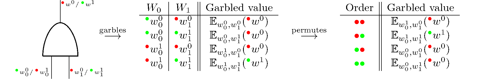

<!--chapter:end:index.Rmd-->

# Secure multi-party computation

La Secure multi-party computation (SMPC) è una sottocategoria della crittografia che si pone come obiettivo quello di  elaborare metodi di calcolo congiunto di una funzione sugli input privati di  due o più parti coinvolte.

A differenza dei compiti crittografici tradizionali, secondo i quali la crittografia  ha come fine ultimo quello di garantire la sicurezza e l’integrità della comunicazione o dell’archiviazione, e l’avversario è esterno al sistema dei partecipanti; la crittografia del modello informatico che andremo di seguito ad analizzare, ha come finalità quella di proteggere la privacy dei partecipanti l’uno dall’altro.

Ci troviamo in un periodo storico in cui i dati, col passare degli anni, stanno diventando un elemento sempre più  centrale per le dinamiche economiche ed informatiche e, in quanto tali, nuovo oggetto di interesse per le aziende. Il massivo incremento della loro importanza in campo economico e informatico trova una spiegazione nel cambiamento/ incremento della loro funzione. Se infatti inizialmente i dati venivano considerati come semplici “informazioni” relative agli utenti, attualmente  essi si sono evoluti e trasformanti in potenziali nuovi metodi di profitto.

Questo processo di cambiamento della funzione e del valore dei dati ha portato alla nascita di un nuovo modello di business primario, attualmente comune a molte delle più grandi aziende, e priorità di tante altre, basato prettamente sulla monetizzazione dei dati relativi agli utenti.

Per fare in modo che l’applicazione di un simile modello di business risulti efficace, è necessario tuttavia effettuare la raccolta di grandi quantità di dati,  ne consegue che il successo di tale operazione sarà  tanto più significativo quante più correlazioni e rapporti di casualità sarà possibile trovare combinando diverse fonti dati. E’ necessario però considerare tutte le problematiche derivanti da questa nuova dinamica.  

Uno dei sottoprodotti potenzialmente rischiosi di questo processo è ad esempio  la possibile violazione della privacy individuale della persona, in quanto le aziende, incrementando la quantità di dati, possiederanno molte informazioni personali dei loro utenti.

Per far fronte a questa possibile problematica sono state studiate e sviluppate molteplici soluzioni  nelle quali sia possibile utilizzare fonti dati diverse, senza però dover necessariamente centralizzare l’informazione. Questa tecnica fa in modo che la privacy individuale degli utenti venga protetta e garantisce  che nessuna informazione venga rivelata a terzi nel corso delle operazioni.

Le nuove dinamiche relative alla sicurezza dei dati stileranno dunque  le basi e le premesse  dell’attuale processo per la sicurezza chiamato Secure multiparty computation (SMPC). In altri termini , grazie al SMPC, sarà possibile consentire ai Data Scientist e Data Analyst di operare sui dati senza il bisogno di esporli o spostarli dalla loro sede di storage di partenza.

\newpage

## Panoramica

In una SMPC prendiamo in considerazione un dato numero di partecipanti, che al fine delle analisi chiameremo $p_1, p_2, ..., p_N$, ad ognuno di essi verranno associati i propri dati privati, che invece chiameremo  $d_1, d_2, ..., d_N$. L’intento del processo nasce dalla necessità dei partecipanti di  calcolare il valore di una funzione pubblica con i loro dati privati: $F(d_1, d_2, ..., d_N)$ mantenendo però i loro input segreti.

Facciamo un esempio: supponiamo di avere tre parti che chiameremo rispettivamente Alice, Bob e Charlie. A ciascuno di loro sono associati  i rispettivi input $x$, $y$ e $z$ che denotano i loro stipendi. Essi hanno come obbiettivo quello di scoprire quale sia tra i tre stipendi che percepiscono quello più alto, senza però rivelare  agli altri quanto guadagna  ciascuno di loro.

Questa premessa  si traduce Matematicamente nel seguente calcolo: $(x,y,z) = max(x, y, z)$

Se ci fosse una parte esterna fidata ( ipotizziamo che i tre partecipanti abbiano un amico comune, lo chiameremo Tony, che deve necessariamente mantenere i segreti delle parti coinvolte ), ognuno dei partecipanti potrebbe  comunicare il proprio stipendio a Tony, così facendo lui potrebbe calcolare quale tra i tre è quello maggiore e, in seguito,  riferire quel numero a tutti loro.

L’obiettivo di SMPC è quello di evitare la situazione in cui i partecipanti, una volta portato a termine il confronto, vengano a conoscenza di un ulteriore dato rispetto al proprio di partenza o  rispetto all’output del processo. Per questo motivo il SMPC si pone come scopo quello di progettare un protocollo nel quale , scambiando messaggi solo tra di loro, Alice, Bob e Charlie possono ancora calcolare $F(x, y, z)$ senza però rivelare  il loro stipendio agli altri e senza dover dipendere da terzi. Essi infatti, durante l’esecuzione di questo protocollo, non dovrebbero venire a conoscenza di più dati di quanti ne saprebbero interagendo con un ipotetico Tony incorruttibile e perfettamente degno di fiducia.

In particolare, tutto ciò  di cui le parti possono venire a conoscenza è ciò che loro stesse possono apprendere dall’output del confronto e dal loro stesso input. Così nell’esempio precedente, se l’output è $z$ allora Charlie impara che il suo  è il valore massimo, mentre Alice e Bob imparano (se $x$, $y$ e $z$ sono distinti), che il loro input non è uguale al massimo, e che il massimo è uguale a $z$. Lo scenario di base può essere facilmente generalizzato ai casi in cui le parti hanno diversi input e output, e la funzione fornisce valori diversi alle diverse parti.

\newpage

Un protocollo di calcolo sicuro multipartitico deve offrire alcune garanzie di sicurezza,  valide anche nei casi in cui alcune delle parti  siano in collusione o  cerchino di violarne le regole. Queste garanzie possono essere definite come qui di seguito:

- **Input Privacy**: Nessuna delle parti corrotte (o suo sottoinsieme) deve in nessun modo essere in grado di derivare alcuna informazione sui dati appartenenti alle altre parti, ad eccezione di quanto rivelato dal risultato finale dell’operazione.
- **Correctness**: Nessuna delle parti corrotte (o suo sottoinsieme) deve essere in grado di indurre una parte onesta a produrre un risultato errato.Un protocollo di calcolo sicuro multipartitico deve offrire alcune garanzie di sicurezza, persino se alcune delle parti fossero in collusione o cercassero di violarne le regole.

## Garanzie di sicurezza

Per fare in modo che Un protocollo di calcolo a più parti sia considerato efficace, esso deve garantire degli standard di sicurezza e, Nella crittografia moderna, la sicurezza di un protocollo è strettamente legata ad una dimostrazione della sicurezza stessa del protocollo. La dimostrazione di sicurezza è da considerarsi una dimostrazione matematica in cui l’affidabilità di un protocollo è ridotta a quella della sicurezza delle sue primitive sottostanti. Tuttavia, non è sempre possibile formalizzare la verifica di sicurezza del protocollo crittografico basata sulla conoscenza delle parti e sulla correttezza del protocollo stesso.

\newpage

Per i protocolli MPC, l’ambiente in cui il protocollo opera è associato alla definizione del paradigma del mondo reale e del mondo ideale. Non è possibile dire che le parti non imparino nulla, poiché devono imparare l’output dell’operazione, e l’output dipende dagli input. Inoltre, la correttezza dell’output non è garantita, poiché la correttezza dell’output dipende dagli input delle parti, e si deve supporre che gli input siano corrotti.
Il paradigma del mondo reale/mondo ideale afferma due mondi che possiamo cosi definire e descrivere: 

- Nel modello del mondo ideale, esiste una parte incorruttibile fidata a cui ogni partecipante al protocollo invia il suo input. Questa parte fidata calcola la funzione da sola e rimanda l’output appropriato ad ogni parte senza rivelare ulteriori dati se non l’output del sistema. 
- Al contrario, nel modello del mondo reale, non esiste una parte fidata e tutto ciò che le parti possono fare è scambiare messaggi tra loro senza ricorrere ad un interlocutore esterno. Un protocollo è detto sicuro se non si può imparare di più sugli input privati di ogni parte nel mondo reale di quanto si potrebbe imparare nel mondo ideale. Nel mondo ideale, nessun messaggio viene scambiato tra le parti, quindi i messaggi scambiati nel mondo reale non possono rivelare alcuna informazione segreta agli altri utenti.

Il paradigma mondo reale/mondo ideale fornisce una semplice astrazione delle complessità di MPC per consentire la costruzione di un'applicazione sotto la premessa che il protocollo MPC nel suo nucleo sia in realtà un'esecuzione ideale. Se l'applicazione è sicura nel caso ideale, allora è sicura anche quando viene eseguito un protocollo reale.

A differenza delle applicazioni crittografiche tradizionali, come la crittografia o la firma, si deve assumere che l’avversario in un protocollo MPC sia uno dei giocatori impegnati nel sistema (o che controlla le parti interne). E che dunque Quella/e parti corrotte possano esse stesse colludere per violare la sicurezza del protocollo dall'interno. 

\newpage

Sia $n$ il numero di parti nel protocollo e $t$ il numero di parti che possono essere avversarie. I protocolli e le soluzioni per il caso di $t< n/2$ (cioè quando si assume una maggioranza onesta) sono diversi da quelli in cui non viene fatta tale assunzione,quelli cioè dove le parti avversarie all’interno del sistema siano presenti in numero maggiore rispetto alle parti oneste. Quest’ultimo scenario include l’importante caso di calcolo a due parti in cui uno dei partecipanti può essere corrotto, e il caso generale in cui un numero illimitato di partecipanti è corrotto e collude per attaccare i partecipanti onesti.

Gli avversari affrontati dai diversi protocolli possono essere classificati in base a quanto, nel loro tentativo di eludere il sistema, sono disposti a deviare dal protocollo. Ci sono essenzialmente due tipi di avversari, ognuno dei quali dà luogo a diverse forme di sicurezza (e ognuno si adatta a diversi scenari del mondo reale):

- **Sicurezza semi-onesta (passiva)**: In questo caso, si assume che le parti corrotte cooperino semplicemente per raccogliere informazioni dal protocollo, ma non si discostino dalle specifiche del protocollo. Questo è un tipo di avversario semplice e ingenuo, che produce una sicurezza debole in situazioni reali. Tuttavia, i protocolli che raggiungono questo livello di sicurezza impediscono la perdita involontaria di informazioni tra le parti (altrimenti collaboranti), e sono quindi utili se questa è l'unica preoccupazione. Inoltre, i protocolli nel modello semi-onesto sono abbastanza efficienti, e sono spesso un primo passo importante per raggiungere livelli più alti di sicurezza.
- **Sicurezza malevola (attiva)**: In questo caso, l’avversario può arbitrariamente discostarsi dall'esecuzione del protocollo nel suo tentativo di ingannare. I protocolli che raggiungono la sicurezza in questo modello forniscono una garanzia di sicurezza molto alta. Il problema sorge Nel caso in cui si presenti una maggioranza delle parti che si comportano scorrettamente. In questo specifico caso , cioè quello di maggioranza disonesta,  L’unica cosa che un avversario può fare  è far sì che le parti oneste interrompano  il processo avendo rilevato l’imbroglio. Ne consegue dunque che Se le parti oneste ottengono l’output, allora hanno la garanzia che esso sia corretto. Anche in questi casi La loro privacy è sempre preservata.

\newpage

La sicurezza contro gli avversari attivi porta tipicamente ad una riduzione dell’efficienza che porta alla sicurezza nascosta, una forma ridotta di sicurezza attiva. La sicurezza nascosta cattura situazioni più realistiche, in cui gli avversari attivi sono disposti a barare ma solo nel caso in cui non vi è la possibilità che il loro tentativo di imbroglio possa venire scoperto poiché, per esempio, tale dinamica potrebbe compromettere o danneggiare la loro reputazione impedendogli così di poter collaborare in futuro con altre parti oneste.

Di conseguenza i protocolli che sono segretamente sicuri forniscono meccanismi per garantire che, se alcune delle parti non seguono le istruzioni, allora sarà notato con alta probabilità. In un certo senso, gli avversari segreti sono quelli considerati attivi ma costretti ad agire passivamente a causa di preoccupazioni esterne non crittografiche (ad esempio la possibilità di compromettere il business). Questo meccanismo stabilisce un ponte tra i due modelli nella speranza di trovare protocolli che siano efficienti e abbastanza sicuri nella pratica.

Come per molti protocolli crittografici, la sicurezza di un protocollo MPC può basarsi su alcuni diversi presupposti:

- **Computazionale** (cioè basata su qualche problema matematico, come la fattorizzazione) o **incondizionata**, cioè basata sull'indisponibilità fisica dei messaggi sui canali (di solito con qualche probabilità di errore che può essere resa arbitrariamente ridotta).
- **Il modello potrebbe assumere diverse dinamiche**: ad esempio che i partecipanti utilizzino una rete sincronizzata dove un messaggio inviato a un “tick” arriva sempre al “tick” successivo, oppure che esista un canale di trasmissione sicuro e affidabile, o ancora che esista un canale di comunicazione sicuro tra ogni coppia di partecipanti dove un avversario non può leggere, modificare o generare messaggi nel canale, ecc.

\newpage

## Two-party computation

Una particolare sotto-categoria delle SMPC che andremo di seguito ad analizzare è la Two-party computation. Questa categoria descrive uno scenario in cui 2 parti parti comunicano tra di loro per la risoluzione di un problema, senza però scambiarsi informazioni sensibili e senza ricorrere all’utilizzo di una terza parte fidata.
Lo scenario a due parti è particolarmente interessante ai fini di un’analisi, in quanto non solo presenta delle diversità dal punto di vista delle applicazioni, ma anche perché a questo scenario a due si possono applicare tecniche speciali che non si applicano nel caso a più parti. Infatti, il calcolo sicuro a più parti è stato presentato per la prima volta nell’impostazione a due parti. Il lavoro originale è spesso citato come proveniente da uno dei due articoli di Yao; anche se gli articoli non contengono effettivamente quello che ora è noto come il Yao’s garbled circuit protocol.

Il protocollo di base di Yao è sicuro contro gli avversari semi-onesti. Possiamo ritenere questo protcollo estremamente efficiente in termini di numero di passaggi in quanto questi sono costanti, e possiamo definirlo indipendente dalla funzione obiettivo che viene valutata. La funzione è vista come un circuito booleano, con ingressi in binario di lunghezza fissa. Un circuito booleano è un insieme di porte collegate con tre diversi tipi di fili: fili di ingresso al circuito, fili di uscita al circuito e fili intermedi. Ogni porta riceve due fili d’ingresso e ha un singolo filo d’uscita che potrebbe essere fan-out (cioè essere passato a più porte al livello successivo). La semplice valutazione del circuito viene fatta valutando ogni porta a turno e assumendo che le porte siano state ordinate topologicamente. Il gate è rappresentato come una tabella di verità tale che per ogni possibile coppia di bit (quelli provenienti dal gate dei fili di ingresso) la tabella assegna un unico bit di uscita; che è il valore del filo di uscita del gate. I risultati della valutazione sono i bit ottenuti nei fili di uscita del circuito.

\newpage

Yao ha spiegato come confondere un circuito (nascondere la sua struttura) in modo che due parti, mittente e ricevitore, possano imparare l’uscita del circuito e nient’altro. Ad un alto livello, il mittente prepara il circuito confuso e lo invia al ricevitore, che ignaro valuta il circuito, imparando le codifiche corrispondenti all’uscita sua e del mittente. Poi si limita a rimandare le codifiche del mittente, permettendo a quest’ultimo di calcolare la sua parte di output. Il mittente invia la mappatura dalle codifiche di uscita dei ricevitori e i bit al ricevitore, permettendo a quest’ultimo di ottenere la propria uscita. 
Nel capitolo successivo andremo ad analizzare più in profondità questo processo, spiegandone dettagliatamente la logica di funzionamento. [@Venturi2012]

<!--chapter:end:01_smpc.Rmd-->

# Yao Garbled Circuit

Per meglio comprendere il funzionamento del processo lo analizzeremo utilizzano un esempio:

Si supponga che Alice e Bob siano disposti a calcolare in modo sicuro una funzione  mantenendo segreti i rispettivi input  e .

Per fare ciò, essi modellano prima la funzione  come un circuito booleano, questo è possibile poiché esiste un circuito booleano  che calcola l’uscita di  per qualsiasi funzione  con ingressi di dimensione fissa. Tuttavia, il modo in cui tale modellazione viene eseguita può dipendere dalla funzione e non sarà ulteriormente discusso qui. Successivamente Alice confonderà il circuito booleano e:

1. Per ogni filo $w_i$ del circuito $C$, sceglie casualmente due valori segreti $w^{0}_{i}$, $w^{1}_{i}$, dove $w^{j}_{i}$ è il valore confuso del valore $j \in \{0,1\}$ del filo $w_i$. Si noti che $w^{j}_{i}$ non può rivelare $j$ di per sé, quindi Alice deve tenere traccia di $i$ e $j$. Questo deve essere fatto per ogni singolo filo di ingresso e di uscita di ogni porta logica del circuito, tranne che per le porte di uscita del circuito che possono essere lasciate in chiaro.
2. Alice dovrà costruire una tabella di verità confusa (GTT) $T_i$ per ciascuna delle porte logiche $G_i$ in $C$.

\newpage

Queste tabelle devono essere tali che dati valori confusi lungo il suo insieme di fili d'ingresso, $T_i$ permetterà di recuperare l'uscita confusa di questo $G_i$ e nessun'altra informazione. Questa dinamica è possibile ottenerla attraverso la crittografia dei valori di uscita. Di seguito dettaglierò ulteriormente il garbling delle porte.

```{r chunk-label, echo = FALSE, fig.cap = 'AND gate con etichette e tabella di verità.', fig.pos = "!H"}

```

In seguito, Alice può tradurre ogni bit del suo input nei suoi corrispondenti valori confusi sui fili di ingresso del circuito. Successivamente può inviare il circuito confuso a Bob con il suo input criptato.

Dopo che Bob ha ricevuto il circuito confuso, poiché tutti i fili d’ingresso sono criptati e solo Alice conosce la mappatura dei valori criptati e i bit reali, Bob ha bisogno di eseguire un Oblivious transfer con Alice per ciascuno dei suoi bit d’ingresso, in modo che Alice possa informarlo di quali valori criptati corrispondono ai suoi bit d’ingresso e sapere quali sono i suoi bit d’ingresso reali.

> **Oblivius transfer**: tipo di protocollo in cui il mittente trasmette un pezzo di informazione a un ricevitore, tra tante potenziali, ma rimane ignaro al mittente quale pezzo di informazione sia stato trasmesso.

Quindi significa che per ogni filo di ingresso, Bob sceglierà una tra le due stringhe casuali $w^{0}_{i}$, $w^{1}_{i}$ che corrispondono rispettivamente a $0$ e $1$, senza però conoscere il contenuto della stringa che non sceglie. Al fine di mantenere i dati in sicurezza,  grazie alle proprietà del Oblivious transfer, Alice non potrà dunque conoscere l’input di Bob.

\newpage

Arrivati a questo punto del processo Bob ha a sua disposizione tutti i valori necessari per calcolare l’uscita del circuito, come discuterò in seguito. Una volta fatto ciò, può comunicare i valori di uscita ad Alice. Seguendo questo procedimento Bob è stato in grado di ottenere l’uscita di  senza rivelare il suo input, né conoscere l’input di Alice, questo significa che Alice e Bob hanno simulato con successo una terza parte fidata e hanno eseguito un SMPC sicuro in cui  è garantita la privacy di entrambi gli utenti partecipanti al sistema.

## Garbling Logical Gates

La nozione di garbling delle porte logiche e della loro tabella di verità risulta essere un punto cruciale in questa dinamica. Senza perdita di generalità, considererò solo le porte logiche con due fili di ingresso e un filo di uscita. Come spiegato precedentemente, per una data porta $G \in C$ e i suoi fili d'ingresso $W_0, W_1$ e il suo filo di uscita $W$, Alice doveva scegliere sei diverse stringhe casuali, $w^{0}_{0}, w^{1}_{0}, w^{0}_{1}, w^{1}_{1}, w^0, w^1$ che ha assegnato a ciascun valore dei fili in una mappatura uno a uno, dove $w^{j}_{i}$ rappresenta la stringa casuale assegnata al valore $j$ del filo $W_i$.

Quindi, per confondere la tabella di verità di $G$ in modo da non rivelare alcuna informazione dati due valori di ingresso $w_0$, $w_1$ eccetto il suo valore di uscita $w$ e  nemmeno il tipo di porta logica, Alice può criptare i valori di uscita $w_0$, $w_1$ usando i valori di ingresso confusi come chiavi, adottando un dato schema di crittografia simmetrica $\mathbb{E}$. 

Utilizzeremo la notazione $\mathbb{E}_{k_0,k_2}(x) = \mathbb{E}_{k_0}(\mathbb{E}_{k_1}(x))$ per indicare la cifratura doppia con due chiavi date $k_0, k_1$. Come esempio, criptiamo la tabella di verità della porta AND della figura:

$$\begin{array}{c|c|c||c}
W_0 & W_1 & W & \text{Garbled value} \\ \hline
        w_0^0 & w_1^0 & w^0 & \mathbb{E}_{w_0^0,w_1^0}(w^0) \\
        w_0^0 & w_1^1 & w^0 & \mathbb{E}_{w_0^0,w_1^1}(w^0) \\
        w_0^1 & w_1^0 & w^0 & \mathbb{E}_{w_0^1,w_1^0}(w^0)\\
        w_0^1 & w_1^1 & w^1 & \mathbb{E}_{w_0^1,w_1^1}(w^1)	\\
\end{array}$$

La GTT $T$ del gate $G$ è semplicemente l'insieme $\left\lbrace\mathbb{E}_{w_0^j,w_1^k}(w^{G(j,k)}) \mid j,k \in  \left\lbrace0,1\right\rbrace \right\rbrace$ dei valori confusi, dove $G(j,k)$ corrisponde all'uscita della porta $G$ sotto ingressi $(j,k)$.

\newpage

## Valutazione del Garbled Circuit

Una volta che Bob ha ricevuto il circuito confuso $C$ da Alice e ha ottenuto i valori confusi del suo input attraverso diversi Oblivious transfer, egli può valutare il circuito.

Come premessa è però importante capire che un circuito confuso differisce da un normale circuito booleano per alcuni fattori: 
In un circuito booleano, infatti, semantica e sintassi sono fondamentalmente le stesse. Questo significa che vengono assegnati ad ogni filo due possibili valori semantici, cioè Vero o Falso, e che ,quest’ultimi ,sintatticamente si denotano come un segnale con valori 1 o 0 rispettivamente.

I segnali sopra citati sono considerabili pubblici e, questi stessi segnali sono associati ad ogni filo e chiunque può dedurre dal segnale quale sia il suo valore semantico. Questa condizione cambia però in un circuito confuso.

Nelle dinamiche di un circuito confuso, infatti, i valori semantici riferiti ad ogni segnale, eccetto quelli di uscita del circuito, sono mantenuti segreti e i segnali variano da un filo all’altro.

In questo modo, per valutare il circuito, per ogni porta$G_i$ del circuito, Bob può provare a decifrare i valori nella tabella di verità associata $T_i$ usando i valori di ingresso della porta come chiavi. Una delle voci in $T_i$ sarà poi decifrata nell'uscita del gate. 

questo punto del processo,  sembrerebbe necessario avere un oracolo come unica strada praticabile per la conferma del  successo della decrittazione delle voci di $T_i$; tuttavia è possibile ricorrere ad un “trucco” che descriverò più dettagliatamente qui di seguito.
 
Questo particolare espediente viene chiamato permute-and-point e viene usato per la prima volta [@INPROCEEDINGS] successivamente spiegato più nel dettaglio nella tesi di Phillip Rogoway[@prog].

Il permute-and-point permette di decidere quale voce della GTT deve essere decrittata dati gli input confusi, permettendo di eseguire calcoli più veloci e impedendo comunque al valutatore di dedurre qualcosa dall'ordine delle voci della tabella di verità. [@kolesnikov2008improved]

\newpage

## Permute-and-point

Il meccanismo di Permute-and-point funziona nel seguente modo: per ogni filo di ingresso e uscita $w_i$, Alice concatena un bit casuale $a \in \{0,1\}$ alla fine del suo valore confuso $w^{0}_i$ e concatena il suo valore inverso $b = \overline{a} = 1 - a$ alla fine di $w^{1}_{i}$. Così facendo è  dunque possibile  associare ciascuna delle 4 permutazioni di 2 bit ad una delle entrate della GTT, senza però avere alcuna correlazione tra i bit e i valori della tabella della verità non confusa. In questo modo Alice può semplicemente ordinare la GTT secondo l’ordinamento naturale e darla a Bob che sarà quindi in grado di dedurre, senza bisogno di ulteriori informazioni, quale voce deve decifrare su un dato input. Per ottenere una rappresentazione ancora più chiara di questo “trucco”, quei bit possono essere  rappresentati come una coppia di colori, come  è possibile osservare nella figura 2.2, in cui si notano le modalità con cui la tabella di verità viene modificata in modo da tenere conto di questo metodo.



Queste modifiche permettono a Bob di decifrare semplicemente la voce il cui indice corrisponde ai colori associati ai suoi fili di ingresso e quindi di ottenere il valore del filo di uscita e il suo colore, permettendogli di valutare ulteriormente il circuito. [@4568207]

\newpage

## Esempio di Valutazione


Andiamo ora ad analizzare come si potrebbe valutare il circuito confuso rappresentato nella Figura 2.3 usando il metodo permute-and-point che abbiamo discusso precedentemente. Assumiamo che i valori semantici di ingresso di $(W_1,W_2,W_3,W_4)$ siano $(0,0,1,0)$, il che significa che l'input confuso effettivo è $({\color{green}\bullet}{}w_1^0,{\color{red}\bullet}{}w_2^0,{\color{red}\bullet}{}w_3^1,{\color{green}\bullet}{}w_4^0)$ dove gli $w^i_j$ sono i valori casuali che Alice ha scelto quando ha confuso il circuito, come visto sopra. Assumiamo anche che Alice abbia già fornito il suo input confuso, diciamo $(W_1,W_3)$, e che Bob abbia già ottenuto il suo input confuso $(W_2,W_4)$ da Alice attraverso due applicazioni di Oblivious transfer come descritto nel paragrafo riguardante.

Bob comincerà quindi a valutare prima la porta AND utilizzando l'ingresso $({\color{green}\bullet}{}w_1^0,{\color{red}\bullet}{}w_2^0)$, dato che ha i colori $\color{green}\bullet\color{red}\bullet$ cercherà di decifrare la terza voce della GGT della porta AND, che funziona e quindi gli fornirà il valore confuso ${\color{green}\bullet}{}w_5^0$.

Potrà poi continuare la sua valutazione con la seconda porta, che è la porta OR. Guardando il suo ingresso $({\color{red}\bullet}{}w_3^1,{\color{green}\bullet}{}w_4^0)$ e proverà a decifrare la voce corrispondente a $\color{red}\bullet\color{green}\bullet$ con le chiavi $(w_3^1,w_4^0)$, essa si decifra nel valore confuso ${\color{green}\bullet}{}w_6^1$.

Potrà ora decifrare la porta XOR finale usando l'ingresso calcolato $({\color{green}\bullet}{}w_5^0,{\color{green}\bullet}{}w_6^1)$, decifrando così la voce $\color{green}\bullet\color{green}\bullet$ che gli fornisce il risultato finale: $1$.

Bob non  è a conoscenza di quale sia stato effettivamente l’input di Alice, ne conosce solo l’output finale “1” e le stringhe generate casualmente $w_1^0,w_2^0,w_3^1,w_4^0,w_5^0,w_6^1$. Egli può ancora, per esempio, dedurre dal circuito che i valori semantici di $w_5^0$ e $w_6^1$ sono opposti, tuttavia questo sistema non gli permette di invertire il circuito confuso fino ai valori di ingresso di Alice. 

Ci sono alcuni circuiti in cui non è assicurata la privacy, come per esempio un circuito che calcola la somma degli ingressi. Tuttavia, in questo caso di esempio Bob, conoscendo i suoi valori semantici di ingresso, può semplicemente limitare gli ingressi di Alice a un sottoinsieme dei possibili ingressi, ma non può determinare in modo univoco i reali valori di ingresso di Alice. [@hemenway2014achieving]

<!--chapter:end:02-Yao_Garbled_circuit.Rmd-->

# La sintesi dei circuiti

Nel capitolo precedente abbiamo discusso dell’importanza della presenza di un circuito logico all’interno del protocollo creato da Yao. A livello di funzionalità La scelta di un circuito efficiente è da considerarsi un fattore importantissimo in quanto rende la computazione e i tempi di calcolo delle operazioni non elevati. Ciò che effettivamente rende efficace la scelta è trovare il giusto bilanciamento tra numero di input che le 2 parti coinvolte devono immettere nel circuito e, nel caso di un dominio multivalore, scegliere un dominio non troppo elevato poiché quest’ultimo andrebbe ad immettere, per ogni valore di input, troppi valori che di conseguenza porterebbero ad aumentare i costi totali del circuito. [@brayton1999multi]

La scelta di questi circuiti viene facilitata dall'utilizzo di strumenti chiamati sintetizzatori, questi tool sono stati creati appositamente per andare a ridurre quanto possibile le dimensioni dei circuiti dati loro in ingresso. All’interno di questo lavoro di analisi sono stati utilizzati due tool differenti: **MVSIS** e **ABC**. Entrambi sono stati sviluppati nel tempo dall'università di Berkley. Sia **MVSIS** che **ABC** contengono diversi metodi di sintesi capaci di andare ad eliminare i nodi e le ridondanze superflue all’interno dei circuiti e in grado di sintetizzare il circuito andandone a cambiare radicalmente la struttura interna dei nodi.

Nonostante l’uguale utilizzo per il quale questi due diversi tool sono stati sviluppati, vi sono comunque alcune differenze tra loro che andremo ad analizzare qui di seguito.

\newpage

## MVSIS

**MVSIS** è il primo tool di sintesi dei circuiti di cui parleremo. Grazie alla sua implementazione esso è in grado di manipolare i circuiti con una logica detta “logica multivalore”. Per la sua creazione è stato preso come modello **SIS**, un tool sviluppato e specifico per la logica binaria, cercando di mantenerne simile la logica di funzionamento.

### Design specification

Un circuito multivalore (MV circuit) può essere dato come valore di input a MVSIS tramite l’apposito comando (read_blifmv) e, oltre ai circuiti multivalore,  è possibile anche dare come imput circuiti binari. Internamente, la rappresentazione del progetto è una rete di nodi MV  dove ogni nodo rappresenta una funzione MV con una singola uscita a più valori. È importante però specificare una fondamentale  distinzione con alcuni altri metodi multivalore, cioè  che ogni variabile del nodo può avere un dominio diverso. L'intervallo per la variabile $y_k$ è rappresentato dall'insieme $P_k=\{0,1,...,p_k -1 \}. La funzione il cui esito dà UN SET dei mintermi (Una sola uscita con 0 o 1) per i quali $f_k = i$ (la funzione al nodo $k$ è uguale al valore $i$ ) è chiamata *i-set* della funzione $f_k$ e viene memorizzata in forma SOP (Somma di prodotti). Nel caso di logica a 2 valori, l'insieme 0 corrisponde all'off-set e l'insieme 1 all'on set. Una variabile MV yk è associata all'uscita del nodo k. Un margine congiunge $k$ a $j$ se uno qualsiasi degli i-set di $j$ dipende esplicitamente da $y_k$. La rete ha un insieme di ingressi primari (che possono essere tutti a più valori) e un insieme di nodi di ingressi primari.

\newpage

### Semplificazione dei nodi

L'i-set (uno per ogni valore di output) di un nodo multivalore può essere semplificato con 2 comandi:

- SIMPLIFY
- FULLSIMP

FULLSIMP, tra le 2 opzioni, è quella che garantisce una semplificazione più efficace. Poichè Utilizza il CODC (Compatible Observability Don’t Cares) e l’ MV-image computation. Ogni i-set del nodo è  in seguito semplificato dal metodo di sintesi ESPRESSO-MV utilizzando i valori che siamo stati in grado di ricavare ricorrendo alle due tecniche precedenti. [@mvsis]

### Kernel e Cube Extraction

Oltre all’utilizzo dei sintetizzatori vi è però Un altro importante step che è possibile applicare per operare un’ ottimizzazione del circuito. questo ulteriore passaggio consiste nell’applicare metodi algebrici  al fine di estrarre nuovi nodi che hanno divisori comuni per altri nodi.  Nel tempo sono state sviluppate nuove tecniche algebriche dedicate alla logica MV che ci permettono di trattare uniformemente le variabili binarie e multi-valore. Tra le loro funzioni, queste tecniche algebriche includono svariate possibilità, tra cui: metodi per trovare sottoespressioni comuni, divisione semi-algebrica, decomposizione di una rete multi-valore e fattorizzazione di una forma SOP. Per fare maggiore chiarezza di seguito elencheremo quali sono i I comandi più rilevanti, seguiti da alcune brevi descrizioni delle loro capacità.

1. **FX**: questo comando individua divisori comuni all’interno della rete e crea nuovi nodi all’interno di essa, nei quali vengono raccolti tutti i nodi coinvolti nel divisore comune. 
2. **Decomp**: questo comando esegue una completa fattorizzazione multivaloriale degli i-sets di ogni nodo e, in seguito,  suddivide i nodi secondo queste fattorizzazioni. Dopo questo procedimento viene utilizzato il comando  _resub_, che ricorre  alla divisione algebrica multivalore per eliminare i fattori duplicati all’interno della rete.

\newpage

### Altri comandi per la manipolazione dei nodi

1. **Collapsing**: converte l’intera rete multilivello in modo che le forme SOP per ogni uscita siano in termini di soli ingressi primari. Così il numero di nodi nella rete sarà esattamente il numero di uscite primarie.
2. **Merging**: Acquisisce tutti i nodi della rete e forza un’unione di questi, così facendo genera un singolo nodo multi-valore costruendo un i-set per ogni combinazione di valori creata. Nel caso in cui da questo processo vengano generati i-set  uguali, essi vengono uniti in un singolo nodo.
3. **Encoding**: è considerabile come l’inverso del merging di funzioni binarie, esso infatti Cerca di trovare una buona codifica binaria per ogni variabile multi-valore nella rete, compresi gli ingressi e le uscite primarie. Alla fine di questo procedimento ogni segnale è codificato come un segnale binario. È possibile quindi, grazie al comando encoding, scrivere un file binario a partire da un multivalore. Questo processo di traslazione può essere così spiegato in due fasi:
   1. Inizia dagli ingressi e per ogni nodo, determina se uno dei suoi fanin può essere usato per codificare parzialmente il nodo.
   2. nizia dalle uscite e, in ordine topologico inverso, lavora a ritroso fino agli ingressi primari. Ad ogni nodo, le sue uscite sono codificate utilizzando le informazioni su come sono utilizzati i suoi fanout.
4. **Pair decoding**: Ha la stessa funzione del merging, ma a  differenza del precedente questo comando utilizza un altro metodo per scegliere quali nodi unire.
5. **Bi-decomposition**: roduce dei nodi multi-valore intermedi.  Esso acquisisce una rete MV appiattita, o parzialmente appiattita, e ne genera una nuova composta da porte MAX e MIN multi-valutate a due ingressi e da iterali multi-valutati. In questo processo, per la creazione dei nuovi nodi, Vengono sfruttate sia l’incompletezza della specifica iniziale che le flessibilità generate nel processo di composizione. [@chai2003mvsis] [@yang1991logic]

\newpage

## ABC

ABC è un sistema software in sviluppo che ha come obbiettivi la sintesi e la verifica di circuiti logici sequenziali binari che appaiono in progetti hardware. Il meccanismo di ABC si basa sulla combinazione di  un’ottimizzazione logica scalabile basata su And-Inverter Graphs (AIGs), una mappatura tecnologica basata su DAG per tabelle di look-up, celle standard e algoritmi innovativi per la sintesi e la verifica sequenziale.

Si può dire che Questo programma sia nato dalle esperienze assimilate dall’uso di SIS, VIS e MVSIS , lo sviluppo di ABC è stato portato avanti in quanto Questi sistemi precedentemente citati non erano in grado di fornire un ambiente di programmazione flessibile per implementare le recenti innovazioni, per quanto riguarda l’ambiente SIS, esso risulta essere obsoleto e piuttosto inefficiente nella gestione di grandi circuiti. VIS, invece, essendo stato progettato come strumento di verifica formale per specifiche multi-valore, non fornisce abbastanza flessibilità per la sintesi binaria. Diverso è invece il discorso per quanto riguarda MVSIS che, nonostante il suo ampio utilizzo, presenta alcune problematiche:

- Le strutture dati e gli algoritmi di base di MVSIS possono essere resi considerevolmente più semplici e facili da utilizzare assumendo come punto di partenza le reti binarie.
- Un posto centrale nel nuovo sistema dovrebbe essere dato a una nuova struttura dati, le AIG (reti logiche multilivello composte da AND e inverter a due ingressi), che promettono miglioramenti nella qualità e nel tempo di esecuzione della sintesi e della verifica.

La comprensione di queste problematiche ha spinto a ri-sviluppare i pacchetti di base di MVSIS creando un nuovo ambiente di programmazione chiamato ABC. Come suggerisce il nome, l’obiettivo primario di questo sistema software è quello di mantenere strutture di dati semplici e flessibili in modo da poter essere impiegate da una vasta gamma di applicazioni.

L’obiettivo del progetto ABC è quello di fornire un’implementazione pubblica degli algoritmi di sintesi combinatoria e sequenziale allo stato dell’arte e, allo stesso tempo, creare un ambiente open-source, in cui tali applicazioni possano essere sviluppate e confrontate. La versione attuale di ABC può  ottimizzare, mappare e realizzare progetti industriali a livello di gate con 100K porte e 10K elementi sequenziali cont tempi di calcolo non superiori al minuto prendendo in considerazione un computer moderno. [@mishchenko2007abc]

\newpage

### Sintesi combinatoria

Per comprendere a pieno l’innovazione di ABC ci basta eseguire una comparazione con MVSIS. Infatti, I metodi di logica combinatoria utilizzati da ABC all’interno dei suoi script (resyn e resyn2) sono tipicamente 10-100 volte più veloci se  messi a confronto con gli script utilizzati all’interno di SIS o MVSIS.

In ABC, i confini dei nodi sono inizialmente distrutti dall’hashing strutturale (comando strash), che trasforma una rete logica in un AIG. I confini possono essere ricreati su richiesta utilizzando il comando renode, che può essere considerato come un inverso del comando SIS eliminate. Nel flusso di sintesi presentato sopra la logica viene trasformata a livello di AIG senza creare nodi.

- **Balance**: prende come ingresso un AIG e lo bilancia in modo tale che la struttura risulti equilibrata per il calcolo.
- **Cleanup**:  Mette in atto la rimozione dei nodi logici che non sono a ventaglio in PO e latches. 
- **Collapse**: Collassa tutto il circuito ad una rete ad un solo livello. Le funzioni dei nodi sono rappresentate utilizzando le BDD. 
- **Dsd**: Applica al circuito la decomposizione disjoint-support utilizzando l’algoritmo di Bertacco/Damiani [@ICCAD97]. 
- **fx**: Rileva la logica di condivisione estraendo i divisori a due cubi e i divisori a due lettere a un cubo sfruttando l’algoritmo di Rajski/Vasudevamurthi [@TCAD92].
- **Multi**: Espande l’AIG a due ingressi generando una rete di porte AND a più ingressi.
- **refactor**: Esegue il collasso iterativo e il refactoring dei coni logici nell’AIG  con lo scopo di ridurre sia il numero di nodi AIG che il numero di livelli logici.

\newpage

- **renode**: Assume che l’input sia un AIG. Crea i confini dei nodi in quest’ultimo e collassa la logica intermedia per formare nodi più grandi.
- **rewrite**: Assume che l’input sia un AIG. Crea i legami tra i nodi in quest’ultimo e collassa la logica intermedia allo scopo di formare nodi più grandi.
- **rr**: Esegue la rimozione della ridondanza per le AIG.
- **strash**: Trasforma la rete data in imput al programma in un AIG tramite un livello di hashing strutturale. L’AIG risultante è una rete logica composta da due fattori: porte AND a due ingressi e invertitori rappresentati come attributi complementari sui bordi. L’hashing strutturale è una trasformazione puramente combinatoria, che in quanto tale non modifica in alcun modo il numero e le posizioni delle porte.
- **sweep**: Grazie al suo funzionamento Sweep esegue i seguenti compiti: rimuove i nodi dangling (nodi senza fanout), collassa i buffer e gli inverter nei loro fanout, propaga le costanti, e rimuove i fanin duplicati. Sweep non può però essere applicato a un AIG perché quest’ultimo  è strutturalmente hashed e quindi non ha buffer, invertitori e nodi costanti non propagati. Per rimuovere i nodi dandling nella rete logica è necessario dunque utilizzare cleanup. tramite questi comandi sweep è in gradi di ridisegnare completamente il circuito a livello strutturale.

\newpage

### Sintesi sequenziale

La sintesi sequenziale è un processo che, ove presenti, trasforma la rete corrente modificandone la logica insieme agli elementi di memorizzazione (latches o flip-flops). La rete risultante dalla sintesi sequenziale può avere una codifica di stato e uno spazio di stato diversi rispetto alla rete originale, ma le due reti sono sequenzialmente equivalenti; nello specifico, (partendo dagli stati iniziali, per le stesse sequenze di vettori d’ingresso  vengono generate sequenze identiche di vettori d’uscita). [@manual2006quick]

- **Cycle**: Simula la rete sequenziale con un input casuale per poi aggiornare il suo stato attuale..
- **init**: Ripristina gli stati iniziali di tutte le porte della rete corrente.
- **lcorr**  attua una Implementazione suddivisa di registro-corrispondenza usando l’induzione semplice. Per poi Rilevare e fondere registri che siano sequenzialmente equivalenti.
- **retime**: Implementa diversi tipi di retiming, tra questi citiamo i seguenti: 
   - most forward;
   - most backward;
   - minimum-register;
   - minimum-delay euristico;
   - delay-optimal retiming [@ICCD_1997]

   Quando il circuito è trasformato dall’AIG in una rete logica, le porte sono condivise in modo ottimale attraverso gli archi di fanout . Il calcolo degli stati iniziali dopo il retiming è ridotto ad un problema SAT, che viene risolto ricorrendo a MiniSat.
- **scleanup**: Esegue la pulizia sequenziale, cioè rimuove i nodi e le latches che non sono a fanout.
- **ssw**: Implementa i segnali corrispondenti applicando l’induzione K-step. E in seguito Rileva e fonde i nodi sequenzialmente equivalenti.
- **undc**: Converte i registri con gli stati iniziali don’t care in registri con uno stato iniziale costante -0. In particolare è possibile utilizzare questo comando prima di eseguire qualsiasi verifica sequenziale.
- **xsim**: Esegue la simulazione con $X$ valore  della rete sequenziale corrente. 

<!--chapter:end:03-sintesiCircuiti.Rmd-->

# Analisi

Il protocollo di Yao prevede, durante i suoi scambi, che le due parti coinvolte concordino anche sulla trasmissione di un circuito a cui entrambi gli attori debbano inserire dei valori di input. Uno degli scopi della nostra tesi consiste nel testare l’efficacia dell’utilizzo di un multi valore rispetto all’utilizzo “classico” di un circuito booleano, concentrandoci specificatamente sull'importante valore costituito dal fattore di costo computazionale delle operazioni che vengono svolte.

Per avviare la nostra analisi siamo partiti quindi selezionando un set di circuiti binari con caratteristiche diverse, tra cui differente numero di ingressi, uscite e livelli. Partendo da questa base ci siamo successivamente concentrati sulla ricerca di una metodologia di conversione dei circuiti  atta a traslarli  da un ‘classico’ dominio booleano ad uno multi-valore, dove quindi i valori non sono più rappresentati da 0 e 1 ma da  un set più ampio di valori. Tutto ciò sempre  mantenendo le funzionalità del circuito. Una volta ottenuta una controparte per ogni circuito abbiamo proceduto con un confronto dei circuiti al fine di riuscire ad individuare quali di questi set fossero più efficaci.

\newpage

## La logica multi-valore

La logica multi-valore è una generalizzazione della classica logica booleana. Una delle ragioni per la quale consideriamo questa generalizzazione è che essa può portare ad una comprensione più profonda di problemi specifici. Per generalizzare la struttura alcune proprietà, rispetto a quelle della logica booleana, vanno mantenuta mentre altre dovranno essere scartate. Un altro motivo per cui consideriamo la logica multi-valore è dato dalla sua capacità di poter risolvere alcuni problemi in modo più efficace rispetto alla logica booleana.

- Utilizzo per rappresentazione di funzioni booleane con più output;
- Design di PLA con input decoder;
- Ottimizzazione di macchine a stato finite;
- Testing e verifica.

La logica multi-valore può avere un numero di vantaggi teorici risolvere a quelle booleana:

- Il numero di chip all'interno di un circuito con più on/off può essere ridotto se il segnale nel circuito assume più livelli al posto che i classici 2 messi a disposizione dalla logica booleana;
- Memory design: Memorizzare informazioni a blocchi di 2bit invece che uno raddoppia la densità delle informazioni che si possono racchiudere nello stesso spazio.
- ecc.

Le potenzialità pratiche di questi vantaggi dipendono pesantemente dalla disponibilità della realizzazione di questi circuiti che devono comunque rimanere compatibili con gli standard tecnologici odierni. [@gao2002optimization]

\newpage

### Le funzioni multi-valore

Una funzione multi-valore è una funzione discreta che ha come input e output variabili che assumono più di 2 valori. Solitamente le funzioni multi-valore sono definite come: $f: P_1 \times P_2 \times ... P_n \rightarrow Q$ dove le variabili $x_i$ della funzione prendono valore dal gruppo $P_i = \{ 0,1,2,...,p_i-1 \}, p_i > 1 
, i \in \{ 1,2,...,n\}$ e la funzione prende valori dal set $Q = \{0,1,2,...,q\}, q>1$

### Rappresentazione di funzioni multi-valore

Il modo più semplice per rappresentare un funzione con $m$ valori e $n$ variabili consiste nel creare una tabella di verità con $m^n$ righe, ognuna delle quali specifica il valore della funzione corrispondente alla combinazione delle variabili in ingresso. Una tabella di verità può essere ridisegnata come un rettangolo n-dimensionale con m-valore in una mappa di Karneaugh. Il problema di queste due rappresentazioni consiste nella difficoltà nella rappresentazione in caso di tabelle complesse. Nei prossimi capitoli mostrerò metodi di rappresentazione più efficaci per la logica multi-valore.

#### Positional cube notation

Utilizzata nella logica booleana questa tecnica di visualizzazione può essere utilizzata anche per funzioni con input multi-valore e output booleano. Qunado un letterale binario, $x$ o $x'$, viene rappresentato da un campo a 2 bit una funzione letterali multivalore $m$ viene rappresenta con un campo a $m$ bit. Il valore $i \in M$ corrisponde al bit $i$ dell campo. Un letterale $x^S$ ha 1 in tutte le posizioni $i \in S$. Per esempio:

$$\begin{tabular}{ c|c c c} 
 \hline
 x1/x2 & 0 & 1 & 2 \\ 
 0 & 1 & 0 & 0 \\ 
 1 & 1 & 1 & 1 \\
 2 & 0 & 1 & 1 \\
 \hline
\end{tabular}$$

\newpage

Applicando la Positional Cube Notation diventa:

$$\begin{array}{ccc}
110 & - & 100 \\
101 & - & 010 \\
011 & - & 001 
\end{array}$$

Per il caso booleano una condizione don't care di un valore in una riga corrisponde al fatto che quell'elemento può assumere valori 0 o 1. Per una funzione multi-valore essa può essere rappresentata nel seguente modo:

- Si spezza la funzione $f: M^n \rightarrow M$ rispettando tutti i valori $i \in M$ in $m$ funzione multivalore in input e output multi-valore con la seguente logica $f^i: M^n \rightarrow \{0,1\}$
- Infine si rappresenta ognuna delle funzioni spezzate nella notazione. [@Dubrova2002]

#### Multiple Valued Network

UN Multiple Valued network è un grafo multi-livello simile a quello booleano con la differenza che, ogni nodo, rappresenta una funzione multi-valore. Per sistemi con alto livello di astrazione l'utilizzo di questi grafi può rendere il design della progettazione più intuitivo. Prendiamo, per esempio, il controller di un semaforo, esso può prendere valore _rosso_, _giallo_ o _verde_ piuttosto che considerare l'encoding in modo binario. Questo tipo di progettazione è possibile solamente semplificando il sistema fino a che non è possibile renderlo ancora più ottimale nella manipolazione del dominio dei valori. Il lato negativo di questa tecnica è che la rappresentazione di un sistema non è canonica, poichè una funzione può assumere più rappresentazioni. Questo lato negativo rende il testing più difficoltoso.

\newpage

#### MDDS

Multiple Valued Decision Diagrams sono semplicemente una generalizzazione degli alberi binari di decisione (BDDs). Le funzioni sono rappresentate creando un diagramma aciclico con nodi non terminali $v$ etichettati da una variabile di indice $index(i), i \in \{1,2,...,n\}$. Ogni vertice $v$ ha $m$ uscite dirette verso i nodi figli, chiamtti $child_j(v), j \in M$. Ogni vertice terminale $v$ ha come attributo un valore $value(v)$ in $M$.

{width=70%}

\newpage

## Studio del circuito binario

Analizzando i vari circuiti per testare la nostra tesi  è stato necessario ai fini dell’analisi sviluppare una tecnica di conversione dei circuiti binari di partenza. La caratteristica di una naturale rappresentazione di un circuito consiste nella sua divisione in nodi, ognuno dei quali viene rappresentato da una tabella di verità i cui input e output vanno a correlarsi tra loro tramite dei collegamenti. Soffermandoci più attentamente sulle tabelle di verità abbiamo notato come, andando ad applicare un raggruppamento di  bit per ogni riga della tabella,  sarebbe possibile riuscire a rappresentare un valore di dominio più grande di quello binario del circuito in analisi. Di conseguenza, così facendo, è possibile attuare una riduzione del numero di input richiesti dal gate.

$$\begin{matrix}
    \underbrace{10} & \underbrace{11} & \underbrace{00} \\
    \downarrow & \downarrow & \downarrow  &mod_3 \\
    2 & 3 & 0
\end{matrix}$$

Con questo approccio è possibile non snaturare quella che è la logica della tabella originale poiché, sapendo qual è il nuovo dominio applicato,  abbiamo la possibilità di invertire il processo di conversione ritornando  quindi al circuito originale.

È necessario però considerare i vincoli presentati da questo approccio di conversione dei circuiti booleani. Quest’ultimi risiedono nel fatto che, al momento, la conversione può essere attuata solo e soltanto con un numero pari di input, e che il numero di output sia un divisore del numero di bit utilizzati per il raggruppamento.

\newpage

Una volta definito il metodo di conversione e preso atto dei vincoli di questo tipo di approccio, abbiamo proseguito con la scelta del nuovo dominio da applicare ai circuiti, questo con l’obiettivo di trovare il giusto compromesso per ottenere i seguenti  risultati:

- Una riduzione degli input che facesse diminuire il costo del circuito di ingresso rispetto al circuito di partenza.
- Trovare un dominio multivalore che risulti efficace nella riduzione dei costi. avere un dominio superiore a quello booleano ma troppo elevato significherebbe che, per ogni input, ogni parte dovrebbe inserire tanti valori di input quanti quelli del dominio richiesto e, se si sceglie un dominio troppo grande, nonostante la riduzione degli input ci si troverebbe comunque con un costo totale del circuito elevato. Si è deciso quindi di sperimentare 2 approcci alla scelta di questo valore, uno statico e uno dinamico.

    - **Statico**: per ognuno dei circuiti andremo ad applicare lo stesso valore di dominio, il valore scelto è 3,  in seguito procederemo quindi a raggruppare ogni 2 valori per riga della tabella di verità;
    - **Dinamico**:ogni circuito  verrà analizzato andando a trovare il numero di input e output, successivamente procederemo con il calcolo del valore di M.C.D. e:
        - Se il valore trovato consente alla tabella di verità convertita di avere almeno 2 valori di input, in quel caso si utilizza quel valore per raggruppare i bit delle righe, altrimenti il valore viene dimezzato.
        - Se il valore risultante è un numero che creerebbe un dominio troppo grande, in quel caso viene utilizzato il dominio 3, come nel caso statico.

Una volta definite  tutte le logiche di conversione è stato necessario affrontare una seconda problematica: identificare  un formato di file che rispettasse determinati requisiti, tra questi citiamo:

- un formato in grado di rappresentare i circuiti
- un formato che rispetti le esigenze per poter applicare tutte le elaborazioni sopra descritte
- un formato che possa essere scelto come standard di rappresentazione in modo tale che i risultati ottenuti possano essere utilizzati dai software di sintesi che andremo ad utilizzare successivamente durante l’elaborazione della sperimentazione.

\newpage

Si è presentata dunque la necessità di una rappresentazione che avesse la possibilità  di rappresentare i circuiti con output multipli sulla stessa linea all’interno della tabella di verità

Tra i vari formati a disposizione, dopo averne analizzate le caratteristiche, la scelta è ricaduta sul formato `PLA`, già ampiamente utilizzato per la rappresentazione di circuiti.
Per comprendere meglio questa scelta è necessario però andare a sviscerare le caratteristiche e la struttura del formato selezionato.

### Analisi della struttura PLA

La struttura di un file PLA può essere così descritta:

```pla
.i 4
.o 2
.ilb x1 x2 y1 y2
.ob f1 f2
0--0 00    
0001 01
0-11 --
1-11 01
0101 10
10-- 01
11-- 00
.end
```

Questo `PLA` preso come esempio rappresenta un circuito composto da una sola tabella di verità, la sintassi va a descrivere gli elementi nel seguente modo:

- `.i`: numero di valori di input;
- `.o`: numero di valori di output;
- `.ilb`: nomi e ordine delle variabili di input;
- `.ob`: nomi e ordine delle variabili di output.

\newpage

Il resto del file riportato rappresenta la tabella di verità con i possibili valori che si ottengono combinando i valori di input_file per ottenere gli output. Il circuito sopra descritto presenta 4 variabili di input e 2 valori di output. Come possiamo osservare all’interno della tabella di verità non tutti i valori sono booleani,   è infatti presente anche il valore “-”, esso prende il nome di don’t care e, all’interno del file, può assumere due significati diversi:

- Quando - è presente negli output di una riga significa che l’output per quella determinata riga non genera un valore interessante ai fini dell’analisi;
- Quando - è presente negli input significa che, in quella posizione, la variabile a cui fa riferimento può assumere un qualsiasi valore non andando ad influire sul valore di output che si andrà ad ottenere.

La presenza di questo nuovo valore, non presente nel caso dei circuiti booleani classici, ci presenta la necessità di analizzare  e capire il metodo con cui andare a gestire questi don’t care all’interno del circuito.

### La gestione dei don't care durante la conversione

I dont’t care sono una caratteristica dei file PLA che deve essere gestita in modo funzionale ai cambi di dominio che andremo ad eseguire  all’interno delle tabelle di verità dei nostri circuiti.  Questa gestione è di primaria importanza in quanto, se affrontata nel modo sbagliato, modificherebbe la logica dell’intero circuito,  rendendo di conseguenza la conversione errata. Per fare più chiarezza riguardo il trattamento che applicheremo a questa caratteristica dei PLA, presenteremo l’esempio di  un circuito semplice che ha come valore di dominio di conversione il valore 3. Il circuito avrà la seguente struttura:

```
.i 4
.o 2
.ilb x1 x2 y1 y2
.ob f1 f2
0--0 00    
0001 01
0-11 --
1-11 01
0101 10
10-- 01
11-- 00
.end
```

\newpage

Una volta stabilito  il nostro nuovo dominio di conversione sappiamo quanti bit dobbiamo raggruppare per rappresentare il nostro nuovo dominio. Nel nostro caso, essendo il domino 3, il numero di bit per rappresentare il valore più grande di questo dominio, abbiamo bisogno di un raggruppamento a 2 bit. Procediamo quindi a scandire riga per riga il circuito, raggruppando i bit a blocchi di due sia per tutti i valori di input che per quelli di output.

```
0- -0 00    
00 01 01
0- 11 --
1- 11 01
01 01 10
10 -- 01
11 -- 00
```

Una volta creati questi cluster di bit ci rendiamo conto di come i dont’t care, in alcuni casi, ci rendano impossibile la conversione al nuovo dominio. Per fare in modo che questo problema venga risolto, sarà necessario andare a sviluppare questi valori di don’t care in ‘normali’ valori booleani.

\newpage

Non è però sempre necessario andare a sviluppare i don’t care, per questo motivo andiamo a differenziare due possibili casistiche di intervento applicabili a questi casi:
- Quando il numero di ‘-’ è uguale al numero di bit del raggruppamento multivalore. Quando si presenta questa situazione non c’è la necessità di sviluppare i valori, sarà  infatti sufficiente inserire al posto della coppia di bit un nuovo - rappresentante il don’t care.
    $$ \begin{array}{ccc}
        10 & -- & 01 \\ & \downarrow & \\ 2 & - & 1 
    \end{array}$$
- Quando nel gruppo di bit raggruppati il numero di - è minore del numero di bit richiesti.  Quando si presenta questa circostanza dobbiamo procedere con l’espansione del dont’t care a valori di verità, questo in modo tale da poter affrontare correttamente la conversione nel nuovo dominio.
        $$ \begin{array}{cccc}
            1- & 11 & 01\\
            & \downarrow &\\
            10 & 11 & 01\\
            11 & 11 & 01\\
            & \downarrow &\\
            2 & 3 & 1\\
            3 & 3 & 1
        \end{array}$$

\newpage

Analizzando e applicando queste due differenti casistiche ci è dunque possibile  sviluppare tutto il circuito binario e ottenere una conversione esatta. Il circuito convertito sarà quindi.

```
00 0
02 0
10 0
12 0
01 1
03 -
13 -
23 1
11 2
2- 1
3- 0
```

Con questa nuova struttura è  in fine possibile procedere all’analisi dei circuiti, proseguendo in seguito con l’attività di sintesi logica.

## Implementazione della conversione

La conversione dei circuiti in analisi viene implementata utilizzando il linguaggio di programmazione Python nella versione 3.8. questo implemento avviene senza l’ausilio di nessun package esterno, vengono infatti utilizzate solamente librerie che sono già comprese nel linguaggio in questione.

Questa dinamica fa si che il sistema, una volta installato il linguaggio di programmazione, se non già presente all’interno del SO, risulti essere “ready to use”.

\newpage

### Analisi del circuito

```python
def read_pla(path_file):
  inp = None
  out = None
  inp_array = []
  out_array = []
  truth_table = []
  with open(path_file, 'r') as input_file:
    for line in input_file.readlines():
      if '.i' in line and line[2] == ' ':
        inp = line.split(' ')[1]
      elif '.o' in line and line[2] == ' ':
        out = line.split(' ')[1]
      elif '.ilb' in line:
        inp_array = line.strip().split(' ')[1:]
      elif '.ob' in line:
        out_array = line.strip().split(' ')[1:]
      elif '.end' in line:
        continue
      else:
        line = {
          'inp':  line.strip().split(' ')[0],
          'out':  line.strip().split(' ')[1]
        }
        truth_table.append(line)
  return inp, out, inp_array, out_array, truth_table
```

All’interno del processo sopra rappresentato, La funzione prende in input un circuito binario in formato PLA . Riga per riga,  procede ad un’analisi delle informazioni in base al prefisso all’interno di ogni riga del file, questo prefisso va a differenziare le informazioni del circuito. Scandendo il file recupera:

- Tabella delle verità
- Numero di input
- Numero di output
- Array contenente il nome delle variabili di input;
- Array contenente il nome delle variabili di output;

Queste informazioni  saranno necessarie successivamente per  poter convertire il circuito e poterne calcolare costi effettivi.

\newpage

### Espansione dei don't care

Una volta ottenute tutte le informazioni disponibili dal circuito dato, succesivamente è necessario andare ad identificare all’interno delle tabelle di verità quali sono i don’t care a cui bisogna espandere i valori e quelli che si possono ignorare. Questo passaggio nello specifico è stato la parte più impegnativa riguardante le funzionalità del programma.

```python
n_dont_care = ''
  for i in range(dv):
    n_dont_care += '-'
```

Con questo ciclo vado a creare un array di `-` consecutivi che rispecchiano i cluster di don't care da ignorare nel durante l'analisi delle tabelle di verità. Avrò quindi un array di *n* `-` tanti quanti il numero di bit per rappresentare i numeri del nuovo dominio.

```python
len_truth_table = len(truth_table)
i = 0
while i < len_truth_table:
  if '-' in truth_table[i]['inp']:
    truth_table[i]['inp'] = ''.join(truth_table[i['inp'])
    truth_table[i]['inp'] = [truth_table[i]['inp'[a:a+dv]
                             for a in range(0, le(truth_table[i]['inp'], dv)]
    for a in range(len(truth_table[i]['inp'])):
        if truth_table[i]['inp'][a] == n_dont_care:
            truth_table[i]['inp'][a] = 'k'*le(n_dont_care)
    truth_table[i]['inp'] = ''.join(truth_table[i['inp'])
    new_lines = resolve_dont_care(truth_table[i],'inp')
    truth_table = truth_table[:i] + new_lines +truth_table[i+1:]
    len_truth_table = len(truth_table)
  i += 1
```

\newpage

Tramite questo ciclo *while* l'intero circuito viene scandito e: 

- I valori di input vengono divisi in cluster di *n* bit per rappresentare i nuovi valori del dominio;
 ```python
truth_table[i]['inp'] = [
    truth_table[i]['inp'[a:a+dv]
    for a in range(0, le(truth_table[i]['inp'], dv)]
  ]
```
- Se all'interno dei cluster sono presenti solamente don't care il valore `-` viene sostituito con il valore *k* per differenziarli dai valori dont't care che successivamente verranno espansi
```python
if truth_table[i]['inp'][a] == n_dont_care:
  truth_table[i]['inp'][a] = 'k'*le(n_dont_care)
```

Ora la tabelle è finalmente pronta per l'espansione dei don't care tramite l'appostia funzione sviluppata

Si è utilizzato un ciclo _while_ in questa funzione nonostante in Python sia meno efficiente vista la natura della sua implementazione in quanto la lunghezza della tabella della verità aumenta dinamicamente con l'andare dell'espansione dei don't care individuati.

#### Resolve don't care

La funzione inizia andando ad individuare quanti don't care sono presenti nella linea

```python
def resolve_dont_care(line, in_out):
  n_dc = pow(2, line[in_out].count('-'))
```

\newpage

Successivamente viene iniziato un ciclo che scandisce ogni elemento della linea della tabella di verità, viene creato un array binario della di tante righe quante saranno dopo l'espansione dei don't care.

```python
for h in range(line[in_out].count('-')):
  val_array = create_0_1_array(n_dc, pow(2, h))
```

Successivamente vengono differenziate 2 casistiche:

- Prima iterazione

```python
if h == 0:
  for i in range(n_dc):
    it = 0
    new_line = []
    for j in range(len(input_entry)-1, -1, -1):
      if input_entry[j] == '-' and it == 0:
        new_line.append(val_array[(len(val_array)-1) - i])
        it += 1
      else:
        new_line.append(line[in_out][j])
    new_array.append(new_line[::-1])
```

- Tutte le successive

```python
else:
  it = 0
  for c, l in enumerate(new_array):
    for j in range(len(l)-1, -1, -1):
      if l[j] == '-' and it == 0:
        l[j] = val_array[(len(val_array)-1) - c]
        it += 1
    it = 0
```

Ogni riga viene scandita a partire dal fondo per iniziare a convertire i don't care corrispondenti ai valori meno significativi, sfruttando l'array binario creato spora andiamo a sostituire il simbolo '-' con con il valore booleano corrispondente e creare una nuova linea di un array che conterrà tutti i valori ottenuti dall'espansione.

\newpage

```python
if in_out == 'inp':
  return [{'inp':  l, 'out':  line['out']} for l in new_array]
else:
  return [{'inp':  line['inp'], 'out':  l} for l in new_array]
```

Come possiamo notare dal ```return``` della funzione questa operazione di espansione è possibile sia sugli input che su gli output. Come detto nel capitolo precedente anche l'espansione dei valori di don't care degli output è importante per non perdere l'integrità del circuito.

L'oggetto restituito dalla funzione è un array contenente un vocabolario con la stessa struttura che abbiamo usato durante l'estrazione dei dati dal file `PLA`, questo array sostituirà la riga contenente i don't care espansi.

#### create_0_1_array

```python
def create_0_1_array(le, pad):
  count_1 = pad
  count_0 = pad
  return [str(1) if i % (count_1 + count_0) < count_1 
    else str(0) for i in range(le)]
```

Questa funzione restituisce una tabella di verità data una line con all’interno un numero di don’t care che necessitano di espansione.

Questa tabella creata verrà inserita al posto della linea con i don’t care del circuito, in modo tale  da avere la tabella corretta per la conversione.

Una volta terminato tutto il ciclo tutti i dont't care saranno risolti e la tabella sarà pronta per la conversione nel nuovo valore di dominio.

\newpage

## La conversione in multi valore

Le funzioni analizzate e osservate  nelle sezioni precedenti restituiscono sempre come valore di output una matrice corrispondente alla tabella della verità sviluppata. Questa tabella verrà utilizzata dalla funzione di conversione seguendo lo schema spiegato all’inizio del capitolo.

```python
def create_mv_truth_table(truth_array, dv):
  conv_truth = []
  for line in truth_array:
    line['inp'] = ''.join(line['inp'])
    line['inp'] = [line['inp'][i * dv:(i + 1) * dv]
      for i in range((len(line['inp']) + dv - 1) // dv)]
    if '-' not in line['out']:
      line['out'] = ''.join(line['out'])
      line['out'] = [line['out'][i * dv:(i + 1) * dv]
        for i in range((len(line['out']) + dv - 1) // dv)]
      l_supp_inp = []
      l_supp_out = []
      for val in line['inp']:
        if '-' not in val:
          l_supp_inp.append(int(val, 2))
        else:
          l_supp_inp.append('-')
      for val in line['out']:
        l_supp_out.append(int(val, 2))
      conv_truth.append({
        'inp':  l_supp_inp,
        'out':  l_supp_out
      })
  return conv_truth
```

La funzione prende in ingresso la matrice espansa creata precedentemente e il numero di bit da utilizzare per rappresentare il massimo numero del nuovo dominio multivalore.

\newpage

Inizialmente la funzione 'spezza' la stringa dei valori di input in gruppi di tanti elementi quanti sono i bit per rappresentare il massimo numero, successivamente viene controllato se il gruppo è composto da:

- dont’t care:  in questo caso si procede sostituendoli con un singolo simbolo ‘-’
- numeri binari:  in quest’altro caso si procede con la conversione tramite il metodo int(), per applicare questa conversione sono però necessari due parametri differenti:
  - un numero o una stringa di numeri da convertire
  - la base a cui si vuole fare la conversione

Una volta scandita tutta la tabella di verità abbiamo finalmente ricavato un  circuito convertito. L’utlimo processo da mettere in atto consiste nell’andare a creare un file compatibile per la sintesi dei circuiti.

## La creazione del file blfmv

Per i circuiti multi valore non viene adottato il formato PLA in quanto quest’ultimo viene utilizzato solamente per i circuiti binari. Per sopperire a questa limitazione data dal formato PLA faremo uso di un altro formato standard appositamente creato per la logica multi valore:  il formato blfmv.

Questo formato deriva dal formato blif, ampiamente utilizzato per la logica binaria.

```python
import string
mv_input = [i for i in list(string.ascii_lowercase)[
    :len(mv_table[0]['inp'])]
  ]
mv_output = ['o{}'.format(i) for i in range(len(mv_table[0]['out']))]
with open('{}/blfmv/{}.mv'.format(working_dir, nomefile), 'w') as blif:
  blif.write('.model {}\n'.format(working_dir, nomefile))
  blif.write('.inputs {}\n'.format(
      ' '.join(map(str, mv_input))))
  blif.write('.outputs {}\n'.format(
      ' '.join(map(str, mv_output))))
  blif.write('.mv {} {}\n'.format(
      ', '.join(map(str, mv_input)), mv))
  blif.write('.mv {} {}\n'.format(
      ', '.join(map(str, mv_output)), mv))
  for count, out in enumerate(mv_output):
      blif.write('.table {} {}\n'.format(' '.join(map(str,mv_input)), out))
    for line in mv_table:
      blif.write('{} {}\n'.format(
        ' '.join(map(str, line['inp'])), line['out'][count]))
  blif.write('.end\n')
```

Questa funzione crea un file .mv relativo al circuito creato. Scegliamo questa tipo di file e sintassi poiché nelle fasi successive andremo ad utilizzare dei software che accettano questa sintassi per valutare e sintetizzare i circuiti.

\newpage

## La sintesi

Una volta ottenuti sia il circuito booleano che quello multivalore  procederemo con la sintesi dei circuiti. Quest’ultima si pone come obiettivo la riduzione e l’ottimizzazione della   la struttura dei circuiti stessi, andando a diminuire il numero di ingressi e di tabelle della verità in modo tale da avere dei costi totali minori.

I programmi utilizzati per la sintesi logica sono stati entrambi sviluppati dall'università di Berkley e attualmente sono disponibili con licenza open source.

Per la sintesi durante l’analisi sperimentale sono state utilizzate due alternative:

- MVSIS
- ABC

### MVSIS

E’ il primo programma utilizzato, al suo interno troviamo diversi metodi di sintesi da poter applicare,  i quali sfruttano tecniche differenti. La particolarità di questo tool consiste nel fatto che il programma è in grado di accettare come input sia circuiti binari che multivalore. Il lato negativo dell’utilizzo di questo programma, d’altra parte, è che l’ultima versione di questo software risale al 2005 e quindi non è più mantenuto.

### ABC

ABC, come la sua alternativa descritta sopra, mette a disposizione delle tecniche di sintesi  che presentano il vantaggio di avere degli script pronti che uniscono più metodi, in questo modo è possibile  avere la certezza di non commettere errori o di utilizzare una concatenazione di metodi inefficace.

ABC è un’evoluzione di MVSIS e del più vecchio SIS. Esso viene tuttora mantenuto ma, a differenza di MVSIS, se gli viene dato in ingresso un valore di input, esso viene successivamente convertito in binario e solo in seguito è possibile utilizzare i metodi di sintesi.

Una caratteristica molto utile di questi programmi sta nel fatto che essi accettano come parametri di ingresso degli script contenenti tutte le istruzioni da eseguire. Proseguendo con l’analisi sarò in grado di mostrarvi come tutto il processo di analisi viene automatizzato sfruttando questa caratteristica.

\newpage

### La sintesi tramite i software

La letteratura mette già a disposizione delle sequenze di metodi di sintesi e pulizia dei circuiti efficace ed efficiente, questi comandi si possono chiamare semplicemente dando in input ai due programmi un file contenente un alias per questa sequenza di istruzioni.

```
source abc_alias.abc
read_blif_mv ./prova/blfmv/amd.mv
strash
compress2
cl
resyn2
cl
write_blif_mv ./prova/blfmv/synth/amd.mv
```

Il programma, in questo caso abc, non fa altro che prendere come input uno dei circuiti creati precedentemente e, applicando i metodi di sintesi, crea un  ulteriore file contenente il circuito sintetizzato. In questo modo è successivamente possibile fare degli ulteriori confronti, una volta sintetizzati tutti i circuiti.

## Il calcolo dei costi del circuito

Il costo del circuito viene calcolato sulla base di due fattori fondamentali:
- Quanti input devono inviare entrambe le parti
- Quanti valori devono inviare per ciascun valore di input in base al dominio

Per calcolare questo tipo di informazioni si devono effettuare delle  ulteriori operazioni di lettura sui file precedentemente creati, il tutto analizzando due differenti caratteristiche:

- Gli ingressi di ogni tabella di verità del circuito (andando a controllare quali dei valori di input devono essere inseriti da una delle parti e quali sono ingressi di valori di output delle altre tabelle.)
- Il dominio dei valori di input che devono inserire le parti.

\newpage

### blfmv vs pla

Per poter eseguire  il confronto sopra citato si è preferito utilizzare file che avessero la stessa sintassi di rappresentazione del circuito, sia nel caso multi valore che in quello booleano.

Il formato pla attualmente non dispone di un’alternativa per i file multivalore, ma non è ancora supportata dai tool che abbiamo in utilizzo. Per questo motivo si è deciso di utilizzare il formato blif per rappresentare i circuiti binari. Blif è l’alternativa binaria a blfmv, la sintassi è la stessa con la differenza che non viene specificato il dominio dei valori di input in quanto sempre booleano.

La differenza con pla, invece, sta nel fatto che gli output non possono essere in numero maggiore di 1 per tabella: nella rappresentazione avrò quindi, per ogni nodo del circuito, tante tabelle quanti sono gli output di quel nodo. Questa tipologia di rappresentazione è utilizzata anche nei file blfmv , quindi sarà possibile una comparazione 1:1 tra il circuito binario e  quello multivalore.

Per effettuare questa conversione vengono in aiuto i tool ABC e MVSIS, poiché entrambi contengono metodi di conversione automatica da pla a blif. Questa operazione viene effettuata tramite uno script contenente le istruzioni da eseguire e dato come parametro di ingresso al programma. [@kukimoto1996blif]

```
read_pla ./prova/pla/alu2.pla
write_blif ./prova/blif/alu2.blif
```

A questo punto dell’analisi abbiamo a disposizione tutti i file per poter fare effettuare il confronto dei costi.

\newpage

### Implementazione

```python
with open('{}/{}'.format(working_dir, circuito)) as circ:
  input = None
  output = None
  mv = int(0)
  table_array = []
  for line in circ.readlines():
    if '.inputs' in line.strip():
      input = line.strip().split(' ')[1:]
    if '.outputs' in line.strip():
      output = line.strip().split(' ')[1:]
    if '.mv' in line.strip():
      if mv < int(line.strip().split(' ')[-1]):
        mv = int(line.strip().split(' ')[-1])
    if '.table' in line.strip():
      l = line.strip().split(' ')
      table_array.append(
        {
          'input':    l[1:len(l)-1],
          'output':   l[-1]
        }
      )
    if '.names' in line.strip():
      l = line.strip().split(' ')
      table_array.append(
        {
          'input':    l[1:len(l)-1],
          'output':   l[-1]
        }
      )
  # i blif non hanno .mv, quindi gli do il valore di dominio
  if mv == 0:
    mv = 2
  return {
    'dominio':   mv,
    'input':    input,
    'output':   output,
    'tabelle':  table_array
  }
```

\newpage

Questa funzione, dato un circuito sia binario che mutli-valore,  prende tutte le informazioni ad essa necessarie per poter  effettuare il calcolo.

```python
costo = 0
for t in circuito['tabelle']:
  intersection = len(set(circuito['input']).intersection(t['input']))
  costo = costo + pow(circuito['dominio'], intersection)
return costo
```

Una volta eseguita questa conversione è stato possibile ottenere tutti i valori di costo sia dei circuiti booleani che di quelli binari.

```python
with open('calcolo_costi.csv', 'a') as file:
  file.write(
    'NOME CIRC;COSTO BOOLEANO;INPUT ALICE;INPUT BOB;
    DOMINIO MULTIVALORE;COSTO MULTIVALORE;INPUT ALICEINPUT BOB\n')
  for blfmv in listdir('{}/blfmv'.format(working_dir)):
    if blfmv.endswith('.mv'):
      circ_mv = info_circuito(
          '{}/blfmv/synth'.format(working_dir),blfmv)
      costo_mv = calcolo_costo_circuito(circ_mv)
      if len(circ_mv['input']) % 2 != 0:
          alice_var_mv = int(len(circ_mv['input'])/ 2)
          bob_var_mv = int(len(circ_mv['input']) /2) + 1
      else:
          alice_var_mv = int(len(circ_mv['input'])/ 2)
          bob_var_mv = int(len(circ_mv['input']) /2)
      circ_bool = info_circuito(
          '{}/blif/synth'.format(working_dir), '{}blif'.format(blfmv.split('.')[0]))
      costo_bool = calcolo_costo_circuito(circ_bool)
      if len(circ_bool['input']) % 2 != 0:
          alice_var_bool = int(len(circ_boo['input']) / 2)
          bob_var_bool = int(len(circ_bool['input') / 2) + 1
      else:
          alice_var_bool = int(len(circ_boo['input']) / 2)
          bob_var_bool = int(len(circ_bool['input') / 2)
      file.write('{};{};{};{};{};{};{};{}\n'.forma(blfmv.split('.')[
          0], costo_bool, alice_var_bool,bob_var_bool, circ_mv['dominio'],costo_mv, alice_var_mv, bob_var_mv))
```

Ottenute tutte le informazioni, per avere una migliore visione per l’analisi, esse vengono salvate all'interno di una file _CVS_ con la funzione sopra mostrata.

\newpage

## Automatizzazione dei processi

Tutte le fasi mostrate sopra, più altre secondarie, sono state automatizzate in modo tale che:

- non si debbano  effettuare operazioni ridondati per ogni circuito
- non si generino perdite di dati causate da errori umani.

### Struttura

```
.
├── abc_alias.abc           #alias con metodi sintesi ABC
├── automate.py             #automatizzatore dei processi
├── calcolo_costi.csv
├── calcolo_costi_no_synth.csv
├── facili  #directory contenente i file d'analisi
│   ├── blfmv
│   │   └── synth # circuiti sintetizzati
│   ├── blif
│   │   └── synth
│   └── pla_extended #pla espansi per debugging
├── lib_mv  # libreria con tutti le funzioni create
│   ├── automate_mvsis.py
│   ├── bin_to_mv.py
│   └── caloclo_costo.py
├── pla_to_blif.mvsis   #file con sintesi per MVSIS
├── synth_bool.abc      #file di sintesi  binaria per ABC
└── synth_mv.abc        #file di sintesi multivalore per ABC
```

\newpage

```python
working_dir = './prova'
 if path.exists('{}/blif'.format(working_dir)) 
    and path.exists('{}/blfmv'.format(working_dir)):
        rmtree('{}/blif'.format(working_dir))
        rmtree('{}/blfmv'.format(working_dir))
      
makedirs('{}/blif/synth'.format(working_dir))
makedirs('{}/blfmv/synth'.format(working_dir))
makedirs('{}/blfmv/synth/abc'.format(working_dir))
makedirs('{}/blfmv/synth/mvsis'.format(working_dir))

if path.exists('{}/synth_out.mvsis'.format(working_dir)):
    remove('{}/synth_out.mvsis'.format(working_dir))

if not path.exists('{}/pla'.format(working_dir)):
    print('CARTELLA PLA NON PRESENTE')
    exit
```

In questa fase viene creata la struttura delle directory che conterrà i file con i circuiti sintetizzati . Nel caso in cui questa struttura fosse già presente,  verranno cancellate tutte le cartelle e i file all’interno e successivamente ricreate le cartelle vuote.

```python
bin_to_mv_mcd(working_dir)
if exists('./pla_to_blif.mvsis'):
  remove('./pla_to_blif.mvsis')
pla_to_blif(working_dir)
```

\newpage

In questa sezione vengono chiamate due utility create con lo scopo di generare dei file utilizzabili sia da **ABC** che da **MVSIS**.

- **bin_to_mv_mcd**: ha lo scopo di creare i file *blfmv* di ogni circuito all'interno della directory di lavoro
- **pla_to_blif**: prende dalla directory di lavoro i file *pla* contenenti i circuiti e li converte in *blif* per avere un formato identico di rappresentazione tra i circuiti binari e quelli multivalore.

\newpage

#### pla_to_blif
```python
def pla_to_blif(working_dir):
  with open('./pla_to_blif.mvsis', 'w') as file:
    file.write("source abc_alias.abc\n")
    for ele in os.listdir('{}/pla'.format(working_dir)):
      file.write('read_pla {}/pla/{}\n'.format(working_dir,ele))
      file.write('write_blif {}/blif/{}.blif\n\n'.format(
        working_dir, ele.split('.')[0]))
```

Questa funzione restituisce un file leggibile come input da _mvsis_ o _abc_ in grado di cambiare automaticamente formato dei file da `PLA` a `BLIF`. In questo modo la conversione viene fatta automaticamnte da uno dei programmi scelti senza ricorrere ad ulteriore codice o incappare in errori di conversione. Il file ottenuto ha la seguente struttura.

```
source abc_alias.abc
read_pla ./prova/pla/alu2.pla
write_blif ./prova/blif/alu2.blif

read_pla ./prova/pla/br2.pla
write_blif ./prova/blif/br2.blif

read_pla ./prova/pla/amd.pla
write_blif ./prova/blif/amd.blif
```

In questo modo ogni circuito viene convertito semplicemente chiamando

```python
call(['abc', '-F', './pla_to_blif.mvsis'])
```

\newpage

#### bin_to_mv_mcd

```python
def bin_to_mv_mcd(working_dir):
  for pla in listdir('{}/pla'.format(working_dir)):
    if pla.endswith('.pla'):
      inp, out, inp_array, out_array, truth_table = read_pla(
        '{}/pla/{}'.format(working_dir, pla))
      dv = euclide(int(inp), int(out))
      if int(inp.strip()) == int(out.strip()) or dv == int(inp):
        dv = dv/2
      if dv >= 8:
        dv = 2 
        mv = pow(2, dv)
        print('{}\ninp: {}\nout:{}\nmulti-valore:{}\ndivide ogni:{}\n'.format(pla,
          inp.strip(), out.strip(), int(mv), int(dv)))
        truth_table = expand_dont_care(truth_table, int(dv))
        mv_table = create_mv_truth_table(truth_table, int(dv))
        crete_blif_mv(working_dir, mv_table, int(mv),
          basename(pla).split('.')[0])
```

In questa funzione vengono racchiuse le funzioni descritte precedentemente per la conversione del circuito da binario a multivalore e la creazione dei file utilizzabili dai motori di sintesi. Come detto nei capitoli precedenti utilizzo 2 tecniche di conversione in base al circuito, una statica e una dinamica, qui mostro solo la soluzione dinamica in quanto più complessa ma dalla struttura analoga alla proposta statica.

\newpage

```python
dv = euclide(int(inp), int(out))
  if int(inp.strip()) == int(out.strip())
    or dv == int(inp):
    dv = dv/2
  if dv >= 8:
    dv = 2 

def euclide(a, b):
  while(b != 0):
    R = a % b
    a = b
    b = R
  return a
```

In questa porzione avvengono le fasi di individuazione del M.C.D. tramite la funzione *euclide* e viene effettuato il controllo in caso che il dominio trovato si troppo grande o che ci sia un solo input utilizzando questo dominio.


```python
synth(working_dir)

call(['abc', '-F', './synth_bool.abc'])
call(['abc', '-F', './synth_mv.abc'])
call(['mvsis', '-F', './synth_mv.mvsis'])
```
L'ultimo passo consiste nella sintesi dei circuiti ottenuti e nella loro controparte binaria, la funzione `synth` fa in modo che vengano creati 2 file da dare in ingresso ad `MVSIS` o `ABC` che sintetizzino tutti i circuiti e salvino il risultato in dei file.

#### Synth

```python
def synth(working_dir):  
  with open('./synth_bool.abc', 'w') as file:
    file.write("source abc_alias.abc\n")
    for ele in os.listdir('{}/blif'.format(working_dir)):
      if ele.endswith('.blif'):
        file.write('read_blif {}/blif/{}\n'.format(working_dir,ele))
        file.write('cl\n')
        file.write('resyn2\n')
        file.write('cl\n')
        file.write('write_blif {}/blif/synth/{}.blif\n\n'.format(working_dir,ele.split('.')[0]))
  with open('./synth_mv.abc', 'w') as file:
    file.write("source abc_alias.abc\n")
    for ele in os.listdir('{}/blfmv'.format(working_dir)):
      if ele.endswith('.mv'):
        file.write('read_blif_mv {}/blfmv/{}\n'.format(working_dir, ele))
        file.write('strash\n')
        file.write('compress2\n')
        file.write('cl\n')
        file.write('resyn2\n')
        file.write('cl\n')
        file.write('write_blif_mv {}/blfmv/synth/abc/{}\n\n'.format(working_dele))
  
  with open('./synth_mv.mvsis', 'w') as file:
    for ele in os.listdir('{}/blfmv'.format(working_dir)):
      if ele.endswith('.mv'):
        file.write('read_blif_mv {}/blfmv/{}\n'.format(working_dir, ele))
        file.write('sweep\n')
        file.write('eliminate -l 1\n')
        file.write('simplify -m nocomp\n')
        file.write('eliminate -l 1\n')
        file.write('sweep\n')
        file.write('eliminate -l 5\n')
        file.write('simplify\n')
        file.write('sweep\n')
        file.write('eliminate -l 1\n')
        file.write('sweep\n')
        file.write('fullsimp -m nocomp\n')
        file.write('write_blif_mv {}/blfmv/synth/mvsis/{}\n\n'.format(working_dir, ele))
```

- **synth_bool**: crea il file per la sintesi utilizzata da **ABC** per i circuiti booleani;
- **synth_mv.abc**: crea il file per la sintesi utilizzata da **ABC** per i circuiti multivalore;
- **synth_mv**: crea il file per la sintesi utilizzata da **MVSIS** per i circuiti multivalore;

\newpage

Viene poi controllato se è presente già un file contenente dei costi e, se c'è, lo elimina

```python
if exists('./calcolo_costi.csv'):
    remove('./calcolo_costi.csv')
if exists('./calcolo_costi_no_synth.csv'):
    remove('./calcolo_costi_no_synth.csv')
```

Infine i costi dei circuiti possono essere calcolati

```python
calcolo_costi_synth(working_dir)
calcolo_costi_no_synth(working_dir)

def calcolo_costo_circuito(circuito):
  costo = 0
  for t in circuito['tabelle']:
    intersection = len(set(circuito['input']).intersection(t['input']))
    costo = costo + pow(circuito['dominio'], intersection)
  return costo
```

Le operazioni di calcolo dei costo vengono effettuate e infine viene generato il file *CSV* contenente i risultati.

<!--chapter:end:04-metodologie.Rmd-->

# Risultati sperimentali

Una volta concluso il processo di conversione dei circuiti e  terminato tutto il sistema di automazione dei processi, si è proceduto con l’analisi sperimentale dei dati raccolti, in modo tale da valutare se questo nuovo approccio sviluppato potesse essere considerato una alternativa possibile o vincente rispetto alle proposte già presenti in letteratura.

Tutte le operazioni computazionali sono state effettuate utilizzando un DELL-XPS 13 9350, la macchina ha le seguenti specifiche:

- Processore: Intel i5-6200U@2.30GHz con 2 core e 4 thread
- Memoria: 8Gb LPDDR3@1866MHz
- Sistema Operativo: Ubuntu 21.04

\newpage

## MVSIS

Nelle prime fasi di sperimentazione si e’ decido di utilizzare MVSIS come motore di sintesi , sia per i circuiti binari che per quelli multivalore. Questo primo approccio è nato dalla volontà di replicare le operazioni che si svolgono solitamente sulla logica binaria per poi applicarle alla logica multivalore.

Per le operazioni di sintesi si sono utilizzati i seguenti comandi

```
read_blif_mv ./prova/blfmv/amd.mv
sweep
eliminate -l 1
simplify -m nocomp
eliminate -l 1
sweep
eliminate -l 5
simplify
sweep
eliminate -l 1
sweep
fullsimp -m nocomp
write_blif_mv ./prova/blfmv/synth/mvsis/amd.mv
```
Con questi comandi andiamo ad attuare una sintesi del  circuito preso in ingresso, nello specifico vengono effettuate tutte le operazioni  necessarie di pulizia e di rimozione di nodi inutili tramite i comandi _eliminate_ e _sweep_. Successivamente, tramite _simplify_ e _fullsimp_, il circuito viene semplificato su due livelli: sia  per quanto concerne i nodi presenti all’interno del circuito , sia per quanto riguarda il circuito stesso  nella sua interezza.

Questi comandi sono la conversione della variante **MVSIS** di _script.rugged_ usato con il tool per la logica binaria SIS.  In questo caso, però, Non è stato possibile operare una conversione 1:1 dello script in quanto non tutti i comandi sono replicabili.

Per far fronte alla mancanza di replicabilità di alcuni comandi in questo sistema, è stato necessario eseguire un’ulteriore ricerca Sia In rete che in altri paper riguardanti l’argomento. Quello che ne viene dedotto è che è stato creato ed esiste un determinato script, chiamato _mvsis.rugged_ che ,  secondo la nostra ricerca, dovrebbe rappresentare la vera conversione adattata per il multivalore. Purtroppo però non è stato possibile in alcun modo reperire questo file in nessun repository, rendendolo quindi per noi non utilizzabile ai fini delle analisi.

\newpage

### Conversione multivalore fissa

Come primo approccio alla conversione da binaria a multivalore abbiamo optato per lo stesso valore di dominio per tutti i circuiti. La scelta è stata quella di andare ad aggiungere altri 2 valori rispetto a ad un circuito binario utilizzando il modulo 3.

% \usepackage{rotating}


\begin{table}
\centering
\begin{tabular}{|l|l|l|l|l|l|l|l|l|} 
\hline
\textbf{ NOME CIRC } & \textbf{COSTO BOOL }                                    & \textbf{INPUT ALICE } & \textbf{INPUT BOB } & \textbf{DOMINIO MULTI } & \textbf{COSTO MULTI }                                    & \textbf{INPUT ALICE } & \textbf{INPUT BOB } & \% Guadagno            \\ 
\hline
amd                  & 469                                                     & 7                     & 7                   & 3                       & 47568                                                    & 3                     & 4                   & \textbf{-10042\% }     \\ 
\hline
tms                  & 322                                                     & 4                     & 4                   & 3                       & 2048                                                     & 2                     & 2                   & \textbf{-536\% }       \\ 
\hline
pdc                  & 2818                                                    & 7                     & 7                   & 3                       & 1310720                                                  & 4                     & 4                   & \textbf{-46412\% }     \\ 
\hline
mlp4                 & 594                                                     & 4                     & 4                   & 3                       & 784                                                      & 2                     & 2                   & \textbf{-32\% }        \\ 
\hline
apla                 & 343                                                     & 5                     & 5                   & 3                       & 1029                                                     & 2                     & 3                   & \textbf{-200\% }       \\ 
\hline
f51m                 & 261                                                     & 4                     & 4                   & 3                       & 340                                                      & 2                     & 2                   & \textbf{-30\% }        \\ 
\hline
m4                   & 974                                                     & 4                     & 4                   & 3                       & 1601                                                     & 2                     & 2                   & \textbf{-64\% }        \\ 
\hline
newtpla2             & 48                                                      & 5                     & 5                   & 3                       & 2048                                                     & 2                     & 3                   & \textbf{-4167\% }      \\ 
\hline
test1                & 1095                                                    & 4                     & 4                   & 3                       & 1280                                                     & 2                     & 2                   & \textbf{-17\% }        \\ 
\hline
m2                   & 339                                                     & 4                     & 4                   & 3                       & 1121                                                     & 2                     & 2                   & \textbf{-231\% }       \\ 
\hline
br2                  & 179                                                     & 6                     & 6                   & 3                       & 16384                                                    & 3                     & 3                   & \textbf{-9053\% }      \\ 
\hline
alu1                 & 83                                                      & 6                     & 6                   & 3                       & 5122                                                     & 3                     & 3                   & \textbf{-6071\% }      \\ 
\hline
sqr6                 & 197                                                     & 3                     & 3                   & 3                       & 276                                                      & 1                     & 2                   & \textbf{-40\% }        \\ 
\hline
bench                & 198                                                     & 3                     & 3                   & 3                       & 256                                                      & 1                     & 2                   & \textbf{-29\% }        \\ 
\hline
in5                  & 446                                                     & 7                     & 7                   & 3                       & 117440512                                                & 6                     & 6                   & \textbf{-26331853\% }  \\ 
\hline
newtpla1             & 33                                                      & 5                     & 5                   & 3                       & 1024                                                     & 2                     & 3                   & \textbf{-3003\% }      \\ 
\hline
m3                   & 571                                                     & 4                     & 4                   & 3                       & 1169                                                     & 2                     & 2                   & \textbf{-105\% }       \\ 
\hline
newapla              & 83                                                      & 6                     & 6                   & 3                       & 9728                                                     & 3                     & 3                   & \textbf{-11620\% }     \\ 
\hline
l8err                & 454                                                     & 4                     & 4                   & 3                       & 337                                                      & 2                     & 2                   & \textbf{26\% }         \\ 
\hline
t4                   & 238                                                     & 6                     & 6                   & 3                       & 10240                                                    & 3                     & 3                   & \textbf{-4203\% }      \\ 
\hline
br1                  & 252                                                     & 6                     & 6                   & 3                       & 16384                                                    & 3                     & 3                   & \textbf{-6402\% }      \\ 
\hline
fout                 & 442                                                     & 3                     & 3                   & 3                       & 320                                                      & 1                     & 2                   & \textbf{28\% }         \\ 
\hline
mp2d                 & 136                                                     & 7                     & 7                   & 3                       & 7                                                        & 3                     & 4                   & \textbf{95\% }         \\ 
\hline
alu2                 & 225                                                     & 5                     & 5                   & 3                       & 1282                                                     & 2                     & 3                   & \textbf{-470\% }       \\ 
\hline
t3                   & 131                                                     & 6                     & 6                   & 3                       & 4                                                        & 3                     & 3                   & \textbf{97\% }         \\ 
\hline
p3                   & 385                                                     & 4                     & 4                   & 3                       & 1408                                                     & 2                     & 2                   & \textbf{-266\% }       \\ 
\hline
m1                   & 125                                                     & 3                     & 3                   & 3                       & 225                                                      & 1                     & 2                   & \textbf{-80\% }        \\ 
\hline
bcd\_div3            & 54                                                      & 2                     & 2                   & 3                       & 32                                                       & 1                     & 1                   & \textbf{41\% }         \\ 
\hline
alu3                 & 139                                                     & 5                     & 5                   & 3                       & 4                                                        & 2                     & 3                   & \textbf{97\% }         \\ 
\hline
in7                  & 182                                                     & 7                     & 7                   & 3                       & 23085056                                                 & 6                     & 7                   & \textbf{-12683997\% }  \\ 
\hline
\textasciitilde{}    & \textbf{93,87}                                          & \textbf{4,87}         & \textbf{4,87}       & \textasciitilde{}       & \textbf{4731943,63}                                      & \textbf{2,43}         & \textbf{2,83}       & -13039,51              \\ 
\hline
\textasciitilde{}    & \begin{sideways}\textbf{COSTO BOOL MEDIO}\end{sideways} & \textasciitilde{}     & \textasciitilde{}   & \textasciitilde{}       & \begin{sideways}\textbf{COSTO MULTI MEDIO}\end{sideways} & \textasciitilde{}     & \textasciitilde{}   &                        \\
\hline
\end{tabular}
\end{table}

Questa tabella racchiude i risultati ottenuti dalla sintesi dei circuiti multivalore e dei circuiti binari. Possiamo notare che nella maggior parte dei casi il circuito binario mantiene ancora una grande efficienza rispetto a quello multivalore.

### MVSIS e dominio variabile

Nella sperimentazione successiva si è voluto testare un dominio variabile in base al MCD, come descritto nel capitolo precedente. Nella seguente tabella vengono mostrati i costi dei circuiti senza sintesi. Possiamo osservare che nella maggior parte dei casi il dominio multivalore senza sintesi ha un costo minore . Questo risultato può essere considerato una conseguenza diretta del minor numero di input che le parti dovranno inserire all’interno del protocollo durante la computazione. Questi input, essendo in minor quantità, rendono l’intero processo di sintesi più leggero e meno costoso.

| NOME CIRC | COSTO BOOL       | INPUT ALICE | INPUT BOB | DOMINIO MULTI | COSTO MULTIVALORE | INPUT ALICE | INPUT BOB | % GUADAGNO |
|-----------|------------------|-------------|-----------|---------------|-------------------|-------------|-----------|------------|
| amd       | 393216           | 7           | 7         | 4             | 196608            | 3           | 4         | 50%        |
| tms       | 4096             | 4           | 4         | 16            | 1024              | 1           | 1         | 75%        |
| pdc       | 2621440          | 8           | 8         | 4             | 1310720           | 4           | 4         | 50%        |
| mlp4      | 2048             | 4           | 4         | 16            | 512               | 1           | 1         | 75%        |
| apla      | 12288            | 5           | 5         | 4             | 6144              | 2           | 3         | 50%        |
| f51m      | 2048             | 4           | 4         | 16            | 512               | 1           | 1         | 75%        |
| m4        | 4096             | 4           | 4         | 16            | 1024              | 1           | 1         | 75%        |
| newtpla2  | 4096             | 5           | 5         | 4             | 2048              | 2           | 3         | 50%        |
| test1     | 2560             | 4           | 4         | 4             | 1280              | 2           | 2         | 50%        |
| m2        | 4096             | 4           | 4         | 16            | 1024              | 1           | 1         | 75%        |
| br2       | 32768            | 6           | 6         | 16            | 8192              | 1           | 2         | 75%        |
| alu1      | 32768            | 6           | 6         | 16            | 8192              | 1           | 2         | 75%        |
| sqr6      | 705              | 3           | 3         | 8             | 256               | 1           | 1         | 64%        |
| bench     | 512              | 3           | 3         | 4             | 256               | 1           | 2         | 50%        |
| in5       | 1835008          | 9           | 9         | 4             | 117440512         | 6           | 6         | -6300%     |
| newtpla1  | 2048             | 5           | 5         | 4             | 1024              | 2           | 3         | 50%        |
| m3        | 4096             | 4           | 4         | 16            | 1024              | 1           | 1         | 75%        |
| newapla   | 40960            | 6           | 6         | 4             | 20480             | 3           | 3         | 50%        |
| l8err     | 1283             | 4           | 4         | 16            | 512               | 1           | 1         | 60%        |
| t4        | 32768            | 6           | 6         | 16            | 8192              | 1           | 2         | 75%        |
| br1       | 32768            | 6           | 6         | 16            | 8192              | 1           | 2         | 75%        |
| fout      | 640              | 3           | 3         | 4             | 320               | 1           | 2         | 50%        |
| mp2d      | 229376           | 7           | 7         | 128           | 32768             | 1           | 1         | 86%        |
| alu2      | 8192             | 5           | 5         | 4             | 4096              | 2           | 3         | 50%        |
| t3        | 32768            | 6           | 6         | 16            | 8192              | 1           | 2         | 75%        |
| p3        | 3074             | 4           | 4         | 4             | 1792              | 2           | 2         | 42%        |
| m1        | 768              | 3           | 3         | 8             | 256               | 1           | 1         | 67%        |
| bcd_div3  | 64               | 2           | 2         | 4             | 32                | 1           | 1         | 50%        |
| alu3      | 8192             | 5           | 5         | 4             | 4096              | 2           | 3         | 50%        |
| in7       | 1310720          | 9           | 9         | 4             | 335544320         | 6           | 7         | -25500%    |
|           | 221982,07        | 5,03        | 5,03      |               | 15153786,67       | 1,80        | 2,27      | -10,02     |
|           | COSTO BOOL MEDIO |             |           |               | COSTO MULTI MEDIO |             |           |            |

\newpage
Una vota applicato la sintesi dei circuiti i risultati sono i seguenti:

| NOME CIRC | COSTO BOOL       | INPUT ALICE | INPUT BOB | DOMINIO MULTI | COSTO MULTIVALORE | INPUT ALICE | INPUT BOB | % GUADAGNO |
|-----------|------------------|-------------|-----------|---------------|-------------------|-------------|-----------|------------|
| amd       | 469              | 7           | 7         | 4             | 47568             | 3           | 4         | -10042%    |
| tms       | 322              | 4           | 4         | 16            | 1024              | 1           | 1         | -218%      |
| pdc       | 2818             | 7           | 7         | 4             | 1310720           | 4           | 4         | -46412%    |
| mlp4      | 594              | 4           | 4         | 16            | 512               | 1           | 1         | 14%        |
| apla      | 343              | 5           | 5         | 4             | 1029              | 2           | 3         | -200%      |
| f51m      | 261              | 4           | 4         | 16            | 272               | 1           | 1         | -4%        |
| m4        | 974              | 4           | 4         | 16            | 1024              | 1           | 1         | -5%        |
| newtpla2  | 48               | 5           | 5         | 4             | 2048              | 2           | 3         | -4167%     |
| test1     | 1095             | 4           | 4         | 4             | 1280              | 2           | 2         | -17%       |
| m2        | 339              | 4           | 4         | 16            | 1024              | 1           | 1         | -202%      |
| br2       | 179              | 6           | 6         | 16            | 8192              | 1           | 2         | -4477%     |
| alu1      | 83               | 6           | 6         | 16            | 4097              | 1           | 2         | -4836%     |
| sqr6      | 197              | 3           | 3         | 8             | 200               | 1           | 1         | -2%        |
| bench     | 198              | 3           | 3         | 4             | 256               | 1           | 2         | -29%       |
| in5       | 446              | 7           | 7         | 4             | 1,17E+08          | 6           | 6         | -26331853% |
| newtpla1  | 33               | 5           | 5         | 4             | 1024              | 2           | 3         | -3003%     |
| m3        | 571              | 4           | 4         | 16            | 1024              | 1           | 1         | -79%       |
| newapla   | 83               | 6           | 6         | 4             | 9728              | 3           | 3         | -11620%    |
| l8err     | 454              | 4           | 4         | 16            | 512               | 1           | 1         | -13%       |
| t4        | 238              | 6           | 6         | 16            | 8192              | 1           | 2         | -3342%     |
| br1       | 252              | 6           | 6         | 16            | 8192              | 1           | 2         | -3151%     |
| fout      | 442              | 3           | 3         | 4             | 320               | 1           | 2         | 28%        |
| mp2d      | 136              | 7           | 7         | 3             | 7                 | 3           | 4         | 95%        |
| alu2      | 225              | 5           | 5         | 3             | 1282              | 2           | 3         | -470%      |
| t3        | 131              | 6           | 6         | 3             | 4                 | 3           | 3         | 97%        |
| p3        | 385              | 4           | 4         | 3             | 1408              | 2           | 2         | -266%      |
| m1        | 125              | 3           | 3         | 3             | 225               | 1           | 2         | -80%       |
| bcd_div3  | 54               | 2           | 2         | 3             | 32                | 1           | 1         | 41%        |
| alu3      | 139              | 5           | 5         | 3             | 4                 | 2           | 3         | 97%        |
| in7       | 182              | 7           | 7         | 3             | 23085056          | 6           | 7         | -12683997% |
|           | 393,87           | 4,87        | 4,87      |               | 4716541,87        | 1,93        | 2,43      |            |
|           | COSTO BOOL MEDIO |             |           |               | COSTO MULTI MEDIO |             |           |            |

I costi vengono notevolmente abbassati nel caso del booleano mentre in quello multivalore rimangono più elevati. Analizzando Questo fenomeno potremmo trovare una spiegazione nel fatto che la sintesi sui circuiti binari è nettamente più sviluppata e sono stati scoperti metodi di sintesi più efficaci rispetto a quelli studiati per una logica multivalore.

Il tool MVSIS infatti, come affermato in precedenza, non è più stato sviluppato ne mantenuto. All’atto pratico si presenta infatti più lento nella sintesi ed ha una gestione della memoria che porta a dump di memoria durante l’analisi di circuiti di grandi dimensioni.

\newpage

## ABC

Avendo potuto appurare che, inizialmente il costo del circuito multivalore possiede dei costi più bassi per via del minor numero di input, ma che la logica binaria può appoggiarsi a degli strumenti di sintesi più ottimizzati, si è provato ad utilizzare un approccio ibrido tra i due.

Sfruttando quindi come input un circuito multivalore ad ABC, questo tool è in grado di convertire automaticamente il circuito da multivalore a binario,  in modo tale da poter utilizzare i suoi algoritmi di sintesi nettamente più ottimizzati.

```
read_blif_mv ./prova/blfmv/amd.mv
strash
compress2
cl
resyn2
cl
write_blif_mv ./prova/blfmv/synth/abc/amd.mv
```

Rispetto a prima però vi sarà la differenza che l’output post sintesi non sarà più un circuito multivalore, bensì uno binario.

\newpage

## ABC e dominio fisso

Come con *MVSIS* abbiamo inizialmente utilizzato un dominio fisso per svolgere una prima analisi.

| NOME CIRC | COSTO BOOL       | INPUT ALICE | INPUT BOB | DOMINIO MULTI | COSTO MULTIVALORE | INPUT ALICE | INPUT BOB | % GUADAGNO |
|-----------|------------------|-------------|-----------|---------------|-------------------|-------------|-----------|------------|
| amd       | 469              | 7           | 7         | 2             | 1860              | 7           | 7         | -297%      |
| tms       | 322              | 4           | 4         | 2             | 198               | 4           | 4         | 39%        |
| pdc       | 2818             | 7           | 7         | 2             | 6032              | 7           | 7         | -114%      |
| mlp4      | 594              | 4           | 4         | 2             | 764               | 4           | 4         | -29%       |
| apla      | 343              | 5           | 5         | 2             | 213               | 5           | 5         | 38%        |
| f51m      | 261              | 4           | 4         | 2             | 808               | 4           | 4         | -210%      |
| m4        | 974              | 4           | 4         | 2             | 643               | 4           | 4         | 34%        |
| newtpla2  | 48               | 5           | 5         | 2             | 48                | 5           | 5         | 0%         |
| test1     | 1095             | 4           | 4         | 2             | 354               | 4           | 4         | 68%        |
| m2        | 339              | 4           | 4         | 2             | 320               | 4           | 4         | 6%         |
| br2       | 179              | 6           | 6         | 2             | 110               | 6           | 6         | 39%        |
| alu1      | 83               | 6           | 6         | 2             | 83                | 6           | 6         | 0%         |
| sqr6      | 197              | 3           | 3         | 2             | 263               | 3           | 3         | -34%       |
| bench     | 198              | 3           | 3         | 2             | 47                | 3           | 3         | 76%        |
| in5       | 446              | 7           | 7         | 2             | 1336              | 7           | 7         | -200%      |
| newtpla1  | 33               | 5           | 5         | 2             | 33                | 5           | 5         | 0%         |
| m3        | 571              | 4           | 4         | 2             | 381               | 4           | 4         | 33%        |
| newapla   | 83               | 6           | 6         | 2             | 81                | 6           | 6         | 2%         |
| l8err     | 454              | 4           | 4         | 2             | 434               | 4           | 4         | 4%         |
| t4        | 238              | 6           | 6         | 2             | 197               | 6           | 6         | 17%        |
| br1       | 252              | 6           | 6         | 2             | 153               | 6           | 6         | 39%        |
| fout      | 442              | 3           | 3         | 2             | 214               | 3           | 3         | 52%        |
| mp2d      | 136              | 7           | 7         | 2             | 315               | 5           | 6         | -132%      |
| alu2      | 225              | 5           | 5         | 2             | 554               | 5           | 5         | -146%      |
| t3        | 131              | 6           | 6         | 2             | 160               | 6           | 6         | -22%       |
| p3        | 385              | 4           | 4         | 2             | 139               | 4           | 4         | 64%        |
| m1        | 125              | 3           | 3         | 2             | 116               | 3           | 3         | 7%         |
| bcd_div3  | 54               | 2           | 2         | 2             | 46                | 2           | 2         | 15%        |
| alu3      | 139              | 5           | 5         | 2             | 406               | 5           | 5         | -192%      |
| in7       | 182              | 7           | 7         | 2             | 1676              | 7           | 7         | -821%      |
|           | 393,87           | 4,87        | 4,87      |               | 599,47            | 4,80        | 4,83      | -0,55      |
|           | COSTO BOOL MEDIO |             |           |               | COSTO MULTI MEDIO |             |           |            |

E’ ora possibile notare come i risultati siano già migliorati e , in molti casi,  la sintesi del circuito multivalore risulti essere migliore di quella binaria, tranne in sporadici casi.

## ABC e dominio variabile

Come ultimo test, come in MVSIS,  abbiamo deciso di applicare anche l’approccio MCD.

| NOME CIRC 	| COSTO BOOL       	| INPUT ALICE 	| INPUT BOB 	| DOMINIO MULTI 	| COSTO MULTIVALORE 	| INPUT ALICE 	| INPUT BOB 	| % GUADAGNO 	|
|-----------	|------------------	|-------------	|-----------	|---------------	|-------------------	|-------------	|-----------	|------------	|
| amd       	| 469              	| 7           	| 7         	| 2             	| 1860              	| 7           	| 7         	| -297%      	|
| tms       	| 322              	| 4           	| 4         	| 2             	| 184               	| 4           	| 4         	| 43%        	|
| pdc       	| 2818             	| 7           	| 7         	| 2             	| 6032              	| 7           	| 7         	| -114%      	|
| mlp4      	| 594              	| 4           	| 4         	| 2             	| 669               	| 4           	| 4         	| -13%       	|
| apla      	| 343              	| 5           	| 5         	| 2             	| 213               	| 5           	| 5         	| 38%        	|
| f51m      	| 261              	| 4           	| 4         	| 2             	| 344               	| 4           	| 4         	| -32%       	|
| m4        	| 974              	| 4           	| 4         	| 2             	| 658               	| 4           	| 4         	| 32%        	|
| newtpla2  	| 48               	| 5           	| 5         	| 2             	| 48                	| 5           	| 5         	| 0%         	|
| test1     	| 1095             	| 4           	| 4         	| 2             	| 354               	| 4           	| 4         	| 68%        	|
| m2        	| 339              	| 4           	| 4         	| 2             	| 350               	| 4           	| 4         	| -3%        	|
| br2       	| 179              	| 6           	| 6         	| 2             	| 130               	| 6           	| 6         	| 27%        	|
| alu1      	| 83               	| 6           	| 6         	| 2             	| 774               	| 6           	| 6         	| -833%      	|
| sqr6      	| 197              	| 3           	| 3         	| 2             	| 234               	| 3           	| 3         	| -19%       	|
| bench     	| 198              	| 3           	| 3         	| 2             	| 47                	| 3           	| 3         	| 76%        	|
| in5       	| 446              	| 7           	| 7         	| 2             	| 1336              	| 7           	| 7         	| -200%      	|
| newtpla1  	| 33               	| 5           	| 5         	| 2             	| 33                	| 5           	| 5         	| 0%         	|
| m3        	| 571              	| 4           	| 4         	| 2             	| 388               	| 4           	| 4         	| 32%        	|
| newapla   	| 83               	| 6           	| 6         	| 2             	| 81                	| 6           	| 6         	| 2%         	|
| l8err     	| 454              	| 4           	| 4         	| 2             	| 338               	| 4           	| 4         	| 26%        	|
| t4        	| 238              	| 6           	| 6         	| 2             	| 248               	| 6           	| 6         	| -4%        	|
| br1       	| 252              	| 6           	| 6         	| 2             	| 136               	| 6           	| 6         	| 46%        	|
| fout      	| 442              	| 3           	| 3         	| 2             	| 214               	| 3           	| 3         	| 52%        	|
| mp2d      	| 136              	| 7           	| 7         	| 2             	| 1677              	| 7           	| 7         	| -1133%     	|
| alu2      	| 225              	| 5           	| 5         	| 2             	| 554               	| 5           	| 5         	| -146%      	|
| t3        	| 131              	| 6           	| 6         	| 2             	| 354               	| 6           	| 6         	| -170%      	|
| p3        	| 385              	| 4           	| 4         	| 2             	| 139               	| 4           	| 4         	| 64%        	|
| m1        	| 125              	| 3           	| 3         	| 2             	| 112               	| 3           	| 3         	| 10%        	|
| bcd_div3  	| 54               	| 2           	| 2         	| 2             	| 46                	| 2           	| 2         	| 15%        	|
| alu3      	| 139              	| 5           	| 5         	| 2             	| 406               	| 5           	| 5         	| -192%      	|
| in7       	| 182              	| 7           	| 7         	| 2             	| 1676              	| 7           	| 7         	| -821%      	|
|           	| 393,87           	| 4,87        	| 4,87      	|               	| 654,50            	| 4,87        	| 4,87      	| -1,15      	|
|           	| COSTO BOOL MEDIO 	|             	|           	|               	| COSTO MULTI MEDIO 	|             	|           	|            	|

In questo caso possiamo appurare che tra i due approcci non ci sono differenze sostanziali, questo  risultato potrebbe essere derivato dalle modalità con cui  abc legge i circuiti multivalore in input.

\newpage

## Conclusioni sui risultati

Una volta terminate tutte le analisi e le sperimentazioni eseguite sui circuiti binari e multivalore siamo stati in grado di trarre alcune informazioni molto importanti riguardanti essi e i loro funzionamenti. Tutti i dati ottenuti da questa sperimentazione ci hanno portati a notare come l'utilizzo della logica multivalore all'interno dei circuiti potrebbe rivelarsi molto interessante in termini di riduzione dei costi relativi ai valori di input che sono richiesti dai circuiti.

La limitazione principale che abbiamo potuto riscontrare è insita nella carenza di strumenti di sintesi a disposizione che possano essere considerati applicabili alla logica multivalore. Come anticipato, solamente **MVSIS** è in grado di gestire e interpretare questo tipo di logica, ma rimane un programma ora mai datato e non più mantenuto, di conseguenza non vi sono al suo interno tool sufficientemente aggiornati o meglio implementati. I nuovi strumenti messi a disposizione, come ad esempio **ABC** accettano in ingresso circuiti multivalore, ma, per poter fare questo, nel loro motore di sintesi essi vengono convertiti in circuiti booleani. L'efficienza e l'efficacia delle nuove funzioni di sintesi attuate da **ABC** hanno reso l'utilizzo di questo software la prima scelta da utilizzare nel caso di circuiti multivalore e binari. 

Applicando un approccio ibrido siamo stati in grado di prendere il meglio dei sintetizzatori presentati. Sfruttando  la riduzione degli input durante la conversione in un dominio maggiore di quello binario combinata all'alta efficacia degli strumenti di sintesi messi a disposizione di **ABC** abbiamo ottenuto i risultati migliori.

\newpage

| **Circuito** 	| **BINARIO** 	| **MULTIVALORE** 	| **MVSIS dom var** 	| **ABC dom var** 	| **Riduzione costo. %** 	|
|--------------	|-------------	|-----------------	|-------------------	|-----------------	|------------------------	|
| amd          	| 393216      	| 196608          	| 47568             	| 1860            	| 96,09%                 	|
| tms          	| 4096        	| 1024            	| 1024              	| 184             	| 82,03%                 	|
| pdc          	| 2621440     	| 1310720         	| 1310720           	| 6032            	| 99,54%                 	|
| mlp4         	| 2048        	| 512             	| 512               	| 669             	| -30,66%                	|
| apla         	| 12288       	| 6144            	| 1029              	| 213             	| 79,30%                 	|
| f51m         	| 2048        	| 512             	| 272               	| 344             	| -26,47%                	|
| m4           	| 4096        	| 1024            	| 1024              	| 658             	| 35,74%                 	|
| newtpla2     	| 4096        	| 2048            	| 2048              	| 48              	| 97,66%                 	|
| test1        	| 2560        	| 1280            	| 1280              	| 354             	| 72,34%                 	|
| m2           	| 4096        	| 1024            	| 1024              	| 350             	| 65,82%                 	|
| br2          	| 32768       	| 8192            	| 8192              	| 130             	| 98,41%                 	|
| alu1         	| 32768       	| 8192            	| 4097              	| 774             	| 81,11%                 	|
| sqr6         	| 705         	| 256             	| 200               	| 234             	| -17,00%                	|
| bench        	| 512         	| 256             	| 256               	| 47              	| 81,64%                 	|
| in5          	| 1835008     	| 117440512       	| 117440512         	| 1336            	| 100,00%                	|
| newtpla1     	| 2048        	| 1024            	| 1024              	| 33              	| 96,78%                 	|
| m3           	| 4096        	| 1024            	| 1024              	| 388             	| 62,11%                 	|
| newapla      	| 40960       	| 20480           	| 9728              	| 81              	| 99,17%                 	|
| l8err        	| 1283        	| 512             	| 512               	| 338             	| 33,98%                 	|
| t4           	| 32768       	| 8192            	| 8192              	| 248             	| 96,97%                 	|
| br1          	| 32768       	| 8192            	| 8192              	| 136             	| 98,34%                 	|
| fout         	| 640         	| 320             	| 320               	| 214             	| 33,13%                 	|
| **MEDIA**     | 230286,73   	| 5409911,27      	| 5402215,91        	| 666,86          	| 65,27%                 	|


\newpage

Questa tabella rappresenta la differenza di costo percentuale tra i due metodi più efficaci provati per ogni motore di sintesi. 

Come possiamo notare come questo tipo di metodica, definita ibrida, risulta essere il migliore approccio testato durante questa sperimentazione in quanto i risultati mostrano una riduzione dei costi computazionali in tutti i casi ad eccezione di due e i restanti risultati hanno una percentuale di guadagno sempre superiore al 30% e, nei casi di circuiti con grande quantità di nodi, anche superiore al 100% riducendo notevolmente il costo computazionale.

La tecnica di analisi ibrida offre i risultati migliori in quanto:

- La conversione di dominio ibrida al minimo dimezza i valori di input da inserire dalle parti e l'algoritmo fa in modo che non venga selezione un dominio eccessivamente grande limitando le possibilità a casi utili in contesti reali;
- **ABC** è un tool recente e sempre più ottimizzato, in continuo aggiornamento e dispone di preset ottimizzati per la sintetizzazione dei circuiti.

La tabella riassume anche qual è stata l'evoluzione di questa analisi sperimentale: inizialmente ci si è concentrati su un metodo ottimale di conversione binaria e abbiamo analizzato se effettivamente questa sperimentazione potesse avere dei reali benefici, successivamente si è passati alla sintesi dei circuiti per capire se la sintesi di domini non binari potesse essere efficace come quella binaria. Una volta individuati i tool migliori si è cercato di capire quali tecniche di sintesi potessero essere le migliori fino ad arrivare ai risultati finali con la constatazione che l'approccio ibrido, ad oggi, risulti la tecnica migliore da noi testata.

<!--chapter:end:05-risultati_sperimentali.Rmd-->

